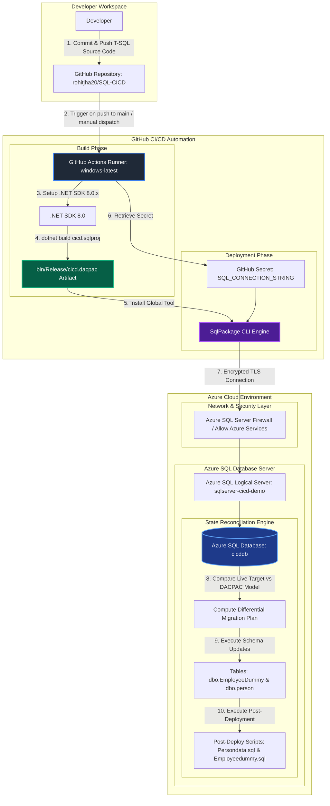
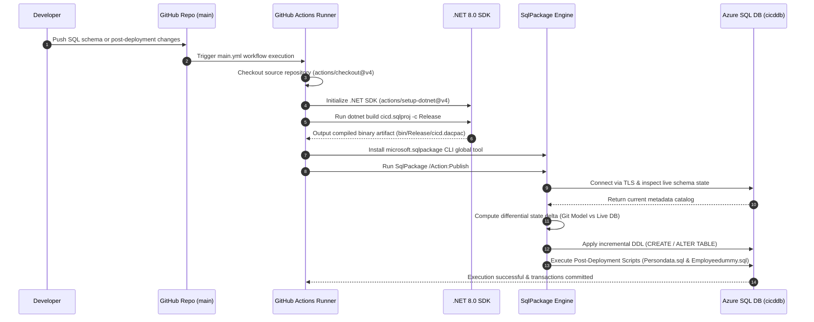

> **Header**: Azure SQL Database CI/CD Architecture, Functional & Technical Specification

---

# Overview

This document provides the definitive architectural, functional, and technical specification for the **SQL-CICD** repository (`cicd.sqlproj`). It details the end-to-end database engineering lifecycle, state-based schema compilation via `.NET SDK 8.0` and `Microsoft.Build.Sql`, GitHub Actions workflow automation, Azure SQL Database infrastructure integration, idempotent data seeding, and production release operations.

By leveraging an SDK-style SQL Database Project format, Microsoft `SqlPackage` deployment engine, and GitHub Actions CI/CD automation, this implementation guarantees declarative, repeatable, and non-destructive database migrations across environments without requiring manual T-SQL DDL script execution.

---

# Index

* **[Overview](#overview)**
* **[Version History](#version-history)**
* **[Header Section 1: Architecture & Technical System Topology](#header-section-1-architecture--technical-system-topology)**
  * [1. Architectural Overview & System Topology](#1-architectural-overview--system-topology)
  * [2. Data Flow & CI/CD Execution Sequence](#2-data-flow--cicd-execution-sequence)
* **[Header Section 2: Repository Structure & SDK Database Project Configuration](#header-section-2-repository-structure--sdk-database-project-configuration)**
  * [1. Repository Directory Taxonomy](#1-repository-directory-taxonomy)
  * [2. Database Project Specification (cicd.sqlproj)](#2-database-project-specification-cicdsqlproj)
  * [3. Schema Definitions (dbo.EmployeeDummy & dbo.person)](#3-schema-definitions-dboemployeedummy--dboperson)
  * [4. Idempotent Post-Deployment Data Seeding](#4-idempotent-post-deployment-data-seeding)
* **[Header Section 3: GitHub Actions CI/CD Pipeline Implementation](#header-section-3-github-actions-cicd-pipeline-implementation)**
  * [1. Workflow Specification (main.yml)](#1-workflow-specification-mainyml)
  * [2. Build Stage: Compilation & DACPAC Generation](#2-build-stage-compilation--dacpac-generation)
  * [3. Deployment Stage: SqlPackage Engine Execution](#3-deployment-stage-sqlpackage-engine-execution)
* **[Header Section 4: Azure Infrastructure, Security & Network Configuration](#header-section-4-azure-infrastructure-security--network-configuration)**
  * [1. Azure SQL Database Infrastructure Setup](#1-azure-sql-database-infrastructure-setup)
  * [2. Network Firewall & GitHub Runner Security](#2-network-firewall--github-runner-security)
  * [3. GitHub Repository Secrets & Connection Security](#3-github-repository-secrets--connection-security)
* **[Header Section 5: Functional Scenarios & Production Best Practices](#header-section-5-functional-scenarios--production-best-practices)**
  * [1. Greenfield vs Incremental Schema Evolution](#1-greenfield-vs-incremental-schema-evolution)
  * [2. Schema Drift Detection & Safety Safeguards](#2-schema-drift-detection--safety-safeguards)
  * [3. Verification, Query Testing & Disaster Recovery](#3-verification-query-testing--disaster-recovery)

---

# Version History

| Version Number | Version Name | Modified By | Modified Date |
| :--- | :--- | :--- | :--- |
| `1.0` | Initial Draft & Architecture Specification | DevOps / Data Engineering Team | 30/12/2025 |
| `1.1` | SDK-Style Migration & Multi-Table Schema Integration | DevOps / Data Engineering Team | 24/07/2026 |
| `1.2` | Comprehensive Technical & Functional Release | DevOps / Data Engineering Team | 24/07/2026 |

---

# Header Section 1: Architecture & Technical System Topology

## 1. Architectural Overview & System Topology

The diagram below illustrates the end-to-end continuous integration and continuous deployment (CI/CD) architecture for managing Azure SQL Database schemas using state-based database engineering:



## 2. Data Flow & CI/CD Execution Sequence



---

# Header Section 2: Repository Structure & SDK Database Project Configuration

## 1. Repository Directory Taxonomy

The repository structure follows standard .NET SDK database project layouts:

```text
SQL-CICD/
├── .github/
│   └── workflows/
│       ├── main.yml          # Primary GitHub Actions CI/CD pipeline definition
│       └── test.sql          # Post-deployment SQL validation & query script
├── dbo/
│   └── Tables/
│       ├── EmployeeDummy.sql # DDL definition for [dbo].[EmployeeDummy]
│       ├── persondetails.sql # DDL definition for [dbo].[person]
│       └── PostDeployment/
│           ├── Employeedummy.sql # Idempotent seed data for [dbo].[EmployeeDummy]
│           └── Persondata.sql    # Idempotent seed data for [dbo].[person]
├── cicd.sqlproj              # SDK-style SQL Database Project configuration file
└── README.md                 # Technical & Functional Specification Document
```

## 2. Database Project Specification (`cicd.sqlproj`)

The project uses the SDK-style [`Microsoft.Build.Sql`](file:///Users/rohitjha/Documents/Git-master/SQL-CICD/cicd.sqlproj) format (version `2.2.0`) targeting Azure SQL Database (`SqlAzureV12`):

```xml
<?xml version="1.0" encoding="utf-8"?>

<Project DefaultTargets="Build">

  <Sdk Name="Microsoft.Build.Sql" Version="2.2.0" />

  <PropertyGroup>
    <Name>cicd</Name>
    <ProjectGuid>{F64078A6-8885-41B6-88F2-CFC1AADC22D5}</ProjectGuid>
    <DSP>Microsoft.Data.Tools.Schema.Sql.SqlAzureV12DatabaseSchemaProvider</DSP>
    <ModelCollation>1033, CI</ModelCollation>
    <TargetFramework>netstandard2.1</TargetFramework>
    <SqlServerVersion>SqlAzureV12</SqlServerVersion>
  </PropertyGroup>

  <ItemGroup>
    <Build Remove=".github\**\*.sql" />
    <Build Remove="cicd\**\*.sql" />
    <Build Remove="dbo\Tables\PostDeployment\Persondata.sql" />
    <PostDeploy Include="dbo\Tables\PostDeployment\Persondata.sql" />
  </ItemGroup>

  <Target Name="BeforeBuild">
    <Delete Files="$(BaseIntermediateOutputPath)\project.assets.json" />
  </Target>

</Project>
```

### Key Property Explanations

* **`<Sdk Name="Microsoft.Build.Sql" Version="2.2.0" />`**: Enables cross-platform compilation of SQL Database projects using standard .NET CLI tooling (`dotnet build`).
* **`<DSP>`**: Configures the Database Schema Provider target as `SqlAzureV12DatabaseSchemaProvider` (Azure SQL Database).
* **`<ItemGroup>`**: Excludes helper/test SQL scripts from compilation while registering post-deployment scripts (`<PostDeploy Include="...">`).
* **`<Target Name="BeforeBuild">`**: Cleans intermediate assets prior to building to ensure clean compilation.

## 3. Schema Definitions (`dbo.EmployeeDummy` & `dbo.person`)

* **`[dbo].[EmployeeDummy]`** ([`dbo/Tables/EmployeeDummy.sql`](file:///Users/rohitjha/Documents/Git-master/SQL-CICD/dbo/Tables/EmployeeDummy.sql)):
  ```sql
  CREATE TABLE [dbo].[EmployeeDummy] (
      [EmployeeID]   INT             IDENTITY (1, 1) NOT NULL,
      [EmployeeName] NVARCHAR (100)  NOT NULL,
      [Department]   NVARCHAR (50)   NULL,
      [Salary]       DECIMAL (10, 2) NULL,
      [JoiningDate]  DATE            NULL,
      [EmailID]      NVARCHAR (200)  NULL,
      [PhoneNumber]  NVARCHAR (15)   NULL,
      [Address]      NVARCHAR (100)  NULL,
      PRIMARY KEY CLUSTERED ([EmployeeID] ASC)
  );
  GO
  ```

* **`[dbo].[person]`** ([`dbo/Tables/persondetails.sql`](file:///Users/rohitjha/Documents/Git-master/SQL-CICD/dbo/Tables/persondetails.sql)):
  ```sql
  CREATE TABLE [dbo].[person] (
      [PersonID]     INT             IDENTITY (1, 1) NOT NULL,
      [Personname]   NVARCHAR (100)  NOT NULL,
      [Relation]     NVARCHAR (50)   NULL,
      [Salary]       DECIMAL (10, 2) NULL,
      [JoiningDate]  DATE            NULL,
      [EmailID]      NVARCHAR (200)  NULL,
      [PhoneNumber]  NVARCHAR (15)   NULL,
      [Address]      NVARCHAR (100)  NULL,
      [City]         NVARCHAR (100)  NULL,
      PRIMARY KEY CLUSTERED ([PersonID] ASC)
  );
  GO
  ```

## 4. Idempotent Post-Deployment Data Seeding

Post-deployment scripts are appended to the deployment workflow by `SqlPackage` and execute immediately after table DDL updates are published. To prevent duplicate key errors during recurring deployments, scripts enforce idempotency using `IF NOT EXISTS` checks.

* **`dbo.person` Reference Seeding** ([`dbo/Tables/PostDeployment/Persondata.sql`](file:///Users/rohitjha/Documents/Git-master/SQL-CICD/dbo/Tables/PostDeployment/Persondata.sql)):
  ```sql
  IF NOT EXISTS (SELECT 1 FROM dbo.person)
  BEGIN
      INSERT INTO dbo.person
      (
          Personname,
          Relation,
          Salary,
          JoiningDate,
          EmailID,
          PhoneNumber,
          Address,
          City
      )
      VALUES
      ('Rahul Sharma', 'Brother', 55000.00, '2024-01-15', 'rahul.sharma@test.com', '9876543210', 'Sector 62', 'Noida'),
      ('Amit Kumar', 'Friend', 65000.00, '2023-06-20', 'amit.kumar@test.com', '9876543211', 'Indirapuram', 'Ghaziabad'),
      ('Priya Singh', 'Sister', 72000.00, '2022-11-10', 'priya.singh@test.com', '9876543212', 'Dwarka', 'Delhi'),
      ('Vikas Verma', 'Father', 80000.00, '2020-05-05', 'vikas.verma@test.com', '9876543213', 'Vaishali', 'Ghaziabad'),
      ('Neha Gupta', 'Mother', 60000.00, '2021-08-18', 'neha.gupta@test.com', '9876543214', 'Noida Extension', 'Greater Noida');
  END
  ```

* **`dbo.EmployeeDummy` Initial Data Seeding** ([`dbo/Tables/PostDeployment/Employeedummy.sql`](file:///Users/rohitjha/Documents/Git-master/SQL-CICD/dbo/Tables/PostDeployment/Employeedummy.sql)):
  ```sql
  IF NOT EXISTS (SELECT 1 FROM dbo.EmployeeDummy)
  BEGIN
      INSERT INTO dbo.EmployeeDummy
      (
          EmployeeName,
          Department,
          Salary,
          JoiningDate
      )
      VALUES
      ('Rahul Sharma', 'IT', 65000.00, '2024-01-15'),
      ('Priya Singh', 'Finance', 72000.00, '2023-08-20'),
      ('Amit Kumar', 'HR', 55000.00, '2022-11-10'),
      ('Neha Gupta', 'Sales', 68000.00, '2024-04-05'),
      ('Vikas Verma', 'Operations', 60000.00, '2023-02-28');
  END
  ```

---

# Header Section 3: GitHub Actions CI/CD Pipeline Implementation

## 1. Workflow Specification (`main.yml`)

The automated workflow file [`.github/workflows/main.yml`](file:///Users/rohitjha/Documents/Git-master/SQL-CICD/.github/workflows/main.yml) defines the CI/CD pipeline targeting `windows-latest`:

```yaml
name: SQL Database CI/CD

on:
  push:
    branches:
      - main
  workflow_dispatch:

jobs:
  build-and-deploy:
    runs-on: windows-latest

    steps:
      - name: Checkout Code
        uses: actions/checkout@v4

      - name: Setup .NET SDK
        uses: actions/setup-dotnet@v4
        with:
          dotnet-version: '8.0.x'

      - name: Build SQL Project
        run: dotnet build cicd.sqlproj --configuration Release

      - name: Install SqlPackage
        shell: pwsh
        run: |
          dotnet tool install --global microsoft.sqlpackage
          echo "$env:USERPROFILE\.dotnet\tools" | Out-File -FilePath $env:GITHUB_PATH -Encoding utf8 -Append

      - name: Verify DACPAC
        shell: pwsh
        run: |
          Get-ChildItem -Recurse bin

      - name: Publish DACPAC
        shell: pwsh
        run: |
          SqlPackage `
            /Action:Publish `
            /SourceFile:"./bin/Release/cicd.dacpac" `
            /TargetConnectionString:"${{ secrets.SQL_CONNECTION_STRING }}"
```

## 2. Build Stage: Compilation & DACPAC Generation

* **Runner Environment**: `windows-latest` GitHub-hosted compute node.
* **SDK Initialization**: `actions/setup-dotnet@v4` configures .NET SDK 8.0.x runtime environment.
* **Compilation Command**: `dotnet build cicd.sqlproj --configuration Release` parses all declarative T-SQL files, builds dependency graphs, validates syntax and primary keys, and emits `bin/Release/cicd.dacpac`.
* **Artifact Verification**: PowerShell step recursively searches the `bin/` directory to confirm DACPAC binary creation prior to deployment.

## 3. Deployment Stage: SqlPackage Engine Execution

* **Tool Installation**: `dotnet tool install --global microsoft.sqlpackage` fetches the latest cross-platform SqlPackage CLI engine.
* **Path Resolution**: `$env:USERPROFILE\.dotnet\tools` is appended to `$env:GITHUB_PATH` so `SqlPackage` can be invoked globally in subsequent steps.
* **Publish Action**: `SqlPackage /Action:Publish /SourceFile:"./bin/Release/cicd.dacpac" /TargetConnectionString:"${{ secrets.SQL_CONNECTION_STRING }}"` connects to Azure SQL Database, evaluates live target state against the source model, generates a minimal diff script, applies DDL updates, and runs post-deployment seed scripts.

---

# Header Section 4: Azure Infrastructure, Security & Network Configuration

## 1. Azure SQL Database Infrastructure Setup

To provision target infrastructure using the Azure CLI:

```bash
# 1. Create Azure Resource Group
az group create --name rg-sql-cicd --location eastus

# 2. Provision Azure SQL Logical Server
az sql server create \
  --name sqlserver-cicd-demo \
  --resource-group rg-sql-cicd \
  --location eastus \
  --admin-user sqladmin \
  --admin-password 'P@ssw0rd12345!'

# 3. Create Target Database
az sql db create \
  --resource-group rg-sql-cicd \
  --server sqlserver-cicd-demo \
  --name cicddb \
  --service-objective S0
```

## 2. Network Firewall & GitHub Runner Security

Because GitHub-hosted runners use dynamic public IP ranges, Azure SQL Server firewall must be configured to permit connection requests originating from Azure services:

```bash
az sql server firewall-rule create \
  --resource-group rg-sql-cicd \
  --server sqlserver-cicd-demo \
  --name "AllowAzureServices" \
  --start-ip-address "0.0.0.0" \
  --end-ip-address "0.0.0.0"
```

## 3. GitHub Repository Secrets & Connection Security

Store the connection string under **GitHub Repository Settings** -> **Secrets and variables** -> **Actions** under the secret key `SQL_CONNECTION_STRING`:

```text
Server=tcp:sqlserver-cicd-demo.database.windows.net,1433;Initial Catalog=cicddb;Persist Security Info=False;User ID=sqladmin;Password=P@ssw0rd12345!;MultipleActiveResultSets=False;Encrypt=True;TrustServerCertificate=False;Connection Timeout=30;
```

---

# Header Section 5: Functional Scenarios & Production Best Practices

## 1. Greenfield vs Incremental Schema Evolution

* **Greenfield Deployment**: When deploying to an empty database, `SqlPackage` creates schema structures (`CREATE TABLE`) and populates initial reference data automatically.
* **Incremental Evolution**: When modifying existing tables (e.g. adding columns to `dbo.EmployeeDummy`), `SqlPackage` issues non-destructive `ALTER TABLE ADD ...` statements without dropping existing table data.

## 2. Schema Drift Detection & Safety Safeguards

For production environments, add pre-deployment drift detection and data loss safety controls to the pipeline:

```powershell
# 1. Generate Pre-Deployment Audit Report
SqlPackage /Action:DeployReport `
  /SourceFile:"./bin/Release/cicd.dacpac" `
  /TargetConnectionString:"$env:CONN_STR" `
  /OutputPath:"./deployment_report.xml"

# 2. Safe Publish with Data Loss Block Enabled
SqlPackage /Action:Publish `
  /SourceFile:"./bin/Release/cicd.dacpac" `
  /TargetConnectionString:"$env:CONN_STR" `
  /p:BlockOnPossibleDataLoss=True `
  /p:DropObjectsNotInSource=False
```

## 3. Verification, Query Testing & Disaster Recovery

Run verification queries against target Azure SQL Database using [`test.sql`](file:///Users/rohitjha/Documents/Git-master/SQL-CICD/.github/workflows/test.sql):

```sql
-- Verify Table Existence & Row Counts
SELECT 'dbo.EmployeeDummy' AS TableName, COUNT(*) AS TotalRows FROM dbo.EmployeeDummy
UNION ALL
SELECT 'dbo.person' AS TableName, COUNT(*) AS TotalRows FROM dbo.person;

-- Audit Seed Records
SELECT * FROM dbo.person;
SELECT * FROM dbo.EmployeeDummy;
```

---
