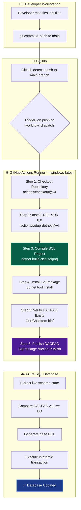
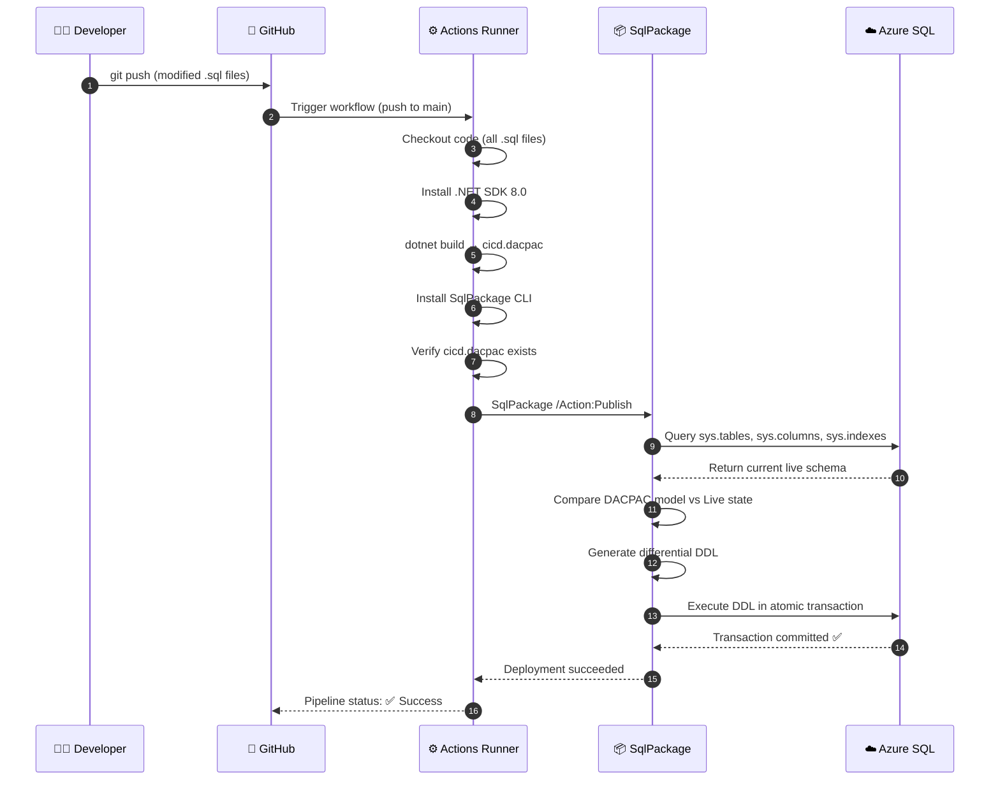
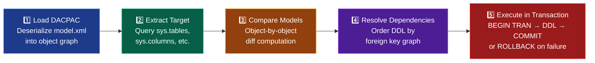
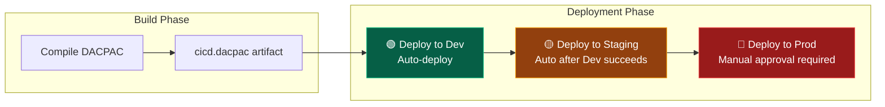

# Azure SQL CI/CD — Steps & Explanation Guide

> **Purpose**: A comprehensive, step-by-step walkthrough of the entire SQL CI/CD pipeline. For each step, this document explains **what happens**, **why it's needed**, the **exact command/YAML used**, and **troubleshooting tips**.

---

## Table of Contents

1. [Pipeline Overview](#-1-pipeline-overview)
2. [Architecture Diagram](#-2-architecture-diagram)
3. [Step 1 — Repository Checkout](#-step-1--repository-checkout)
4. [Step 2 — .NET SDK Setup](#-step-2--net-sdk-setup)
5. [Step 3 — Build SQL Project (Compile DACPAC)](#-step-3--build-sql-project-compile-dacpac)
6. [Step 4 — Install SqlPackage](#-step-4--install-sqlpackage)
7. [Step 5 — Verify DACPAC Artifact](#-step-5--verify-dacpac-artifact)
8. [Step 6 — Publish DACPAC to Azure SQL](#-step-6--publish-dacpac-to-azure-sql)
9. [How the Delta Engine Works Internally](#-how-the-delta-engine-works-internally)
10. [GitHub Secrets Configuration](#-github-secrets-configuration)
11. [Trigger Configuration](#-trigger-configuration)
12. [Multi-Environment Promotion (Dev → Staging → Prod)](#-multi-environment-promotion-dev--staging--prod)
13. [Post-Deployment Verification](#-post-deployment-verification)
14. [Rollback Procedures](#-rollback-procedures)
15. [Quick Reference Card](#-quick-reference-card)
16. [Troubleshooting Guide](#-troubleshooting-guide)

---

## 📋 1. Pipeline Overview

### What This Pipeline Does

This CI/CD pipeline automatically deploys SQL database schema changes to Azure SQL Database whenever code is pushed to the `main` branch. It uses a **state-based (declarative)** model where developers define the **desired end-state** of the database, and the pipeline engine automatically computes and applies the difference.

### End-to-End Flow Summary

```
Developer pushes .sql files to GitHub
        ↓
GitHub Actions triggers the pipeline
        ↓
Pipeline compiles all .sql files into a single DACPAC artifact
        ↓
SqlPackage connects to Azure SQL and extracts the current live state
        ↓
SqlPackage compares DACPAC (desired state) vs Live DB (current state)
        ↓
SqlPackage generates the delta DDL (ALTER, CREATE, DROP statements)
        ↓
SqlPackage executes the delta inside a single atomic transaction
        ↓
Database is now in the desired state ✅
```

### The Complete Pipeline YAML

```yaml
name: SQL Database CI/CD

on:
  push:
    branches:
      - main
  workflow_dispatch:

jobs:
  build-and-deploy:
    runs-on: windows-latest

    steps:
      - uses: actions/checkout@v4                    # Step 1: Checkout

      - uses: actions/setup-dotnet@v4                # Step 2: Setup .NET
        with:
          dotnet-version: '8.0.x'

      - name: Build SQL Project                      # Step 3: Compile
        run: dotnet build cicd.sqlproj --configuration Release

      - name: Install SqlPackage                     # Step 4: Install
        shell: pwsh
        run: |
          dotnet tool install --global microsoft.sqlpackage
          echo "$env:USERPROFILE\.dotnet\tools" | Out-File -FilePath $env:GITHUB_PATH -Encoding utf8 -Append

      - name: Verify DACPAC                          # Step 5: Verify
        shell: pwsh
        run: |
          Get-ChildItem -Recurse bin

      - name: Publish DACPAC                         # Step 6: Deploy
        shell: pwsh
        run: |
          SqlPackage `
            /Action:Publish `
            /SourceFile:"./bin/Release/cicd.dacpac" `
            /TargetConnectionString:"${{ secrets.SQL_CONNECTION_STRING }}"
```

---

## 🏗️ 2. Architecture Diagram

### Pipeline Flow



### Data Flow Sequence



---

## 🔍 Step 1 — Repository Checkout

### YAML

```yaml
- uses: actions/checkout@v4
```

### What Happens

1. GitHub Actions starts a fresh **Windows Server** virtual machine (`windows-latest`).
2. The `actions/checkout@v4` action clones the entire repository (all branches, tags, and files) onto this runner.
3. The runner's working directory is set to the root of the repository.

### Why It's Needed

The runner starts completely empty — it has no knowledge of your code. This step downloads all your `.sql` schema files, the `cicd.sqlproj` file, and the workflow configuration itself onto the runner so subsequent steps can access them.

### What Gets Downloaded

```
📁 Runner Workspace
├── cicd.sqlproj                          ← Project file (build instructions)
├── dbo/
│   ├── Tables/
│   │   ├── EmployeeDummy.sql            ← Table schema
│   │   ├── persondetails.sql            ← Table schema
│   │   └── SchemaEvolutionDemo.sql      ← Table schema
│   └── StoredProcedures/
│       └── GetEmployeeDetails.sql       ← Stored procedure
├── PostDeployment/
│   ├── PostDeployment.sql               ← Post-deploy orchestrator
│   ├── Persondata.sql                   ← Seed data
│   └── Employeedummy.sql               ← Seed data
└── .github/workflows/
    ├── main.yml                         ← This pipeline definition
    └── test.sql                         ← Verification queries
```

### Expected Duration

~2 seconds

### Troubleshooting

| Issue | Cause | Fix |
| :--- | :--- | :--- |
| `Repository not found` | Wrong repository URL or private repo without token | Check repository URL; for private repos, ensure `GITHUB_TOKEN` has read access |
| `Permission denied` | Branch protection rules blocking the runner | Verify the runner has access to the branch |

---

## 🔍 Step 2 — .NET SDK Setup

### YAML

```yaml
- uses: actions/setup-dotnet@v4
  with:
    dotnet-version: '8.0.x'
```

### What Happens

1. The `actions/setup-dotnet@v4` action downloads and installs **.NET SDK 8.0** on the runner.
2. It adds `dotnet` to the system `PATH` so all subsequent steps can use it.
3. The `8.0.x` version pattern means "install the latest patch version of .NET 8.0" (e.g., 8.0.401).

### Why It's Needed

The `cicd.sqlproj` file uses the `Microsoft.Build.Sql` MSBuild SDK, which requires .NET SDK to compile. Without this step, `dotnet build` would fail with `command not found`.

### Why .NET 8.0 Specifically?

| .NET Version | Status | Recommended? |
| :--- | :--- | :--- |
| .NET 6.0 | Out of support | ❌ No |
| .NET 7.0 | Out of support | ❌ No |
| **\*.NET 8.0** | **LTS (Long-Term Support)** — supported until Nov 2026 | **✅ Yes** |
| .NET 9.0 | STS (Standard-Term Support) | ⚠️ Shorter support window |

### Expected Duration

~5 seconds (cached on GitHub-hosted runners)

### Troubleshooting

| Issue | Cause | Fix |
| :--- | :--- | :--- |
| `dotnet: command not found` | SDK installation failed | Ensure `dotnet-version: '8.0.x'` is correct |
| `Could not find SDK` | Wrong version format | Use `'8.0.x'` (with quotes and `.x` suffix) |

---

## 🔍 Step 3 — Build SQL Project (Compile DACPAC)

### YAML

```yaml
- name: Build SQL Project
  run: dotnet build cicd.sqlproj --configuration Release
```

### What Happens

1. `dotnet build` invokes **MSBuild** with the `Microsoft.Build.Sql` SDK.
2. MSBuild scans the project tree for all `.sql` files (excluding those listed in `<Build Remove>` directives).
3. Each `.sql` file is parsed and validated against the **Azure SQL V12 T-SQL grammar**.
4. If all files pass validation, they are compiled into a single **DACPAC** (Data-tier Application Package) at `bin/Release/cicd.dacpac`.
5. The PostDeployment scripts are packaged separately within the DACPAC (they are NOT compiled as schema objects).

### Why It's Needed

This is the **core compilation step**. It transforms your human-readable `.sql` files into a machine-readable binary model. The DACPAC contains the complete database model — every table, column, constraint, index, and stored procedure — in a format that `SqlPackage` can compare against a live database.

### What Gets Validated

| Validation | Example Error |
| :--- | :--- |
| **T-SQL Syntax** | Missing semicolons, unclosed brackets |
| **Object References** | Stored procedure references a table that doesn't exist in the project |
| **Platform Compatibility** | Using a SQL Server-only feature while targeting Azure SQL |
| **Data Type Validity** | Using a deprecated or unsupported data type |
| **Constraint Integrity** | CHECK constraint references a column that doesn't exist |

### Build Output Structure

```
bin/
└── Release/
    ├── cicd.dacpac            ← The compiled deployment artifact (this is what gets deployed)
    ├── cicd.dll               ← .NET assembly wrapper
    └── cicd.pdb               ← Debug symbols
```

### Expected Duration

~4 seconds

### Troubleshooting

| Issue | Cause | Fix |
| :--- | :--- | :--- |
| `SQL46010: Incorrect syntax near...` | T-SQL syntax error in a `.sql` file | Run `dotnet build` locally to see the exact file and line number |
| `SQL71561: Procedure has unresolved reference to object` | SP references a table not in the project | Ensure the table `.sql` file exists in `dbo/Tables/` |
| `SQL71501: SqlAzureV12 does not support` | Using a feature not available on Azure SQL | Check Azure SQL compatibility for the feature |
| NuGet restore fails | Network issue or corrupted cache | Delete `obj/` folder and rebuild |

---

## 🔍 Step 4 — Install SqlPackage

### YAML

```yaml
- name: Install SqlPackage
  shell: pwsh
  run: |
    dotnet tool install --global microsoft.sqlpackage
    echo "$env:USERPROFILE\.dotnet\tools" | Out-File -FilePath $env:GITHUB_PATH -Encoding utf8 -Append
```

### What Happens

1. **Line 1**: `dotnet tool install --global microsoft.sqlpackage` downloads and installs SqlPackage as a .NET global tool. This places the `SqlPackage.exe` binary in the user's `.dotnet/tools` directory.
2. **Line 2**: Adds the `.dotnet/tools` directory to the `$GITHUB_PATH` environment variable. This makes `SqlPackage` available as a command in all subsequent steps without needing the full path.

### Why It's Needed

`SqlPackage` is Microsoft's official CLI tool for DACPAC deployment. It is the engine that:
- Connects to Azure SQL
- Extracts the current live schema
- Compares it against the DACPAC model
- Generates and executes the differential DDL

Without SqlPackage, you'd have to manually write migration scripts — defeating the purpose of the state-based architecture.

### Why `shell: pwsh`?

| Shell | Why Used Here |
| :--- | :--- |
| `pwsh` (PowerShell Core) | The `$env:USERPROFILE` and `$env:GITHUB_PATH` variables are PowerShell-specific syntax for accessing environment variables on Windows |
| `bash` | Would use `$HOME` and `>>` syntax instead — but this runner is `windows-latest` |

### What is SqlPackage?

| Property | Detail |
| :--- | :--- |
| **Full Name** | Microsoft SqlPackage |
| **Type** | .NET Global Tool (cross-platform CLI) |
| **Publisher** | Microsoft |
| **Actions** | Publish, Script, DeployReport, Export, Import, Extract |
| **Protocol** | TDS (Tabular Data Stream) over port 1433 |
| **Encryption** | TLS 1.2 enforced |

### Expected Duration

~3 seconds

### Troubleshooting

| Issue | Cause | Fix |
| :--- | :--- | :--- |
| `SqlPackage: command not found` | PATH not updated properly | Ensure the `echo` line is present in the YAML |
| `Tool already installed` | Previous run cached the tool | Use `dotnet tool update --global microsoft.sqlpackage` instead |
| Network error during install | Runner has no internet access | Ensure GitHub-hosted runner has outbound HTTPS access |

---

## 🔍 Step 5 — Verify DACPAC Artifact

### YAML

```yaml
- name: Verify DACPAC
  shell: pwsh
  run: |
    Get-ChildItem -Recurse bin
```

### What Happens

1. `Get-ChildItem -Recurse bin` (PowerShell equivalent of `ls -R bin/`) lists all files and subdirectories inside the `bin/` folder.
2. This confirms that the DACPAC was successfully created in Step 3.

### Why It's Needed

This is a **diagnostic safety step**. If the build in Step 3 succeeded but produced no output (rare edge case), this step will show an empty directory — making it immediately obvious that something went wrong before the deployment step runs.

### Expected Output

```
    Directory: /path/to/bin/Release

Mode          LastWriteTime    Length  Name
----          -------------    ------  ----
-a----        8/14/2026 12:00  XXXXX   cicd.dacpac
-a----        8/14/2026 12:00  XXXXX   cicd.dll
-a----        8/14/2026 12:00  XXXXX   cicd.pdb
```

### Expected Duration

~1 second

### Troubleshooting

| Issue | Cause | Fix |
| :--- | :--- | :--- |
| Empty `bin/` directory | Build step failed silently | Check Step 3 output for errors |
| `bin` folder not found | Build was never executed | Ensure Step 3 runs before this step |

---

## 🔍 Step 6 — Publish DACPAC to Azure SQL

### YAML

```yaml
- name: Publish DACPAC
  shell: pwsh
  run: |
    SqlPackage `
      /Action:Publish `
      /SourceFile:"./bin/Release/cicd.dacpac" `
      /TargetConnectionString:"${{ secrets.SQL_CONNECTION_STRING }}"
```

### What Happens

This is the **most critical step** in the entire pipeline. Here's the detailed internal process:

#### Phase 1: Load Source Model
SqlPackage opens `cicd.dacpac` and deserializes it into an in-memory object graph containing every table, column, constraint, index, and stored procedure defined in your project.

#### Phase 2: Connect & Extract Target State
SqlPackage connects to the Azure SQL Database using the connection string from `SQL_CONNECTION_STRING` secret. It then queries the database's system catalog views:

| System View Queried | Information Extracted |
| :--- | :--- |
| `sys.tables` | All existing tables |
| `sys.columns` | All columns in each table |
| `sys.indexes` | All indexes (clustered, nonclustered) |
| `sys.key_constraints` | Primary keys, unique keys |
| `sys.check_constraints` | CHECK constraints |
| `sys.default_constraints` | DEFAULT constraints |
| `sys.sql_modules` | Stored procedure definitions |
| `sys.foreign_keys` | Foreign key relationships |

#### Phase 3: Differential Comparison
SqlPackage compares the two models object-by-object:

| Comparison Result | Action Generated |
| :--- | :--- |
| Object in DACPAC but **not** in target DB | `CREATE TABLE`, `CREATE PROCEDURE`, etc. |
| Object in **both** but with differences | `ALTER TABLE`, `ALTER PROCEDURE`, etc. |
| Object in target DB but **not** in DACPAC | `DROP TABLE` (only if `DropObjectsNotInSource=True`) |
| Object identical in both | **No action** — skipped |

#### Phase 4: Dependency Resolution
SqlPackage orders the generated DDL statements based on dependency graphs:
- Foreign keys are dropped **before** their referenced tables
- Tables are created **before** stored procedures that reference them
- Indexes are created **after** their parent tables

#### Phase 5: Transactional Execution
All DDL is wrapped in a single database transaction:
- If **every** statement succeeds → `COMMIT TRANSACTION` → Database is updated
- If **any** statement fails → `ROLLBACK TRANSACTION` → Database remains unchanged

### Parameter Breakdown

| Parameter | Value | Purpose |
| :--- | :--- | :--- |
| `/Action:Publish` | — | Tells SqlPackage to apply the DACPAC to the target database |
| `/SourceFile` | `./bin/Release/cicd.dacpac` | Path to the compiled DACPAC artifact |
| `/TargetConnectionString` | `${{ secrets.SQL_CONNECTION_STRING }}` | Encrypted connection string from GitHub Secrets |

### Optional Parameters You Can Add

| Parameter | Value | When to Use |
| :--- | :--- | :--- |
| `/p:BlockOnPossibleDataLoss=True` | Boolean | **Production** — halts deployment if any change would lose data |
| `/p:DropObjectsNotInSource=True` | Boolean | When you want to clean up orphaned objects in the target DB |
| `/p:CommandTimeout=600` | Seconds | For large databases with slow schema changes |
| `/p:AllowIncompatiblePlatform=True` | Boolean | When deploying across different SQL Server versions |

### Expected Duration

~5–30 seconds (depending on the number and complexity of schema changes)

### Troubleshooting

| Issue | Cause | Fix |
| :--- | :--- | :--- |
| `Cannot open server requested by login` | Firewall blocking runner IP | Enable "Allow Azure services" in Azure SQL Networking |
| `Login failed for user` | Wrong credentials in connection string | Verify `SQL_CONNECTION_STRING` secret value |
| `Data loss might occur` | Column dropped or type narrowed | Add `/p:BlockOnPossibleDataLoss=False` if intentional |
| `Timeout expired` | Large table rebuild taking too long | Add `/p:CommandTimeout=600` |
| `Could not deploy package` | Platform mismatch | Ensure `SqlServerVersion` in `.sqlproj` matches the target |

---

## ⚙️ How the Delta Engine Works Internally

This section provides a deeper look at how SqlPackage computes and applies schema changes.

### The Five-Phase Process



### Example: Adding a Column

**Developer Action**: Add `[City] NVARCHAR(100) NULL` to `persondetails.sql`

**DACPAC Model** (desired state):
```
Table: dbo.person
  Columns: PersonID, Personname, Relation, Salary, JoiningDate, EmailID, PhoneNumber, Address, City
```

**Live DB** (current state):
```
Table: dbo.person
  Columns: PersonID, Personname, Relation, Salary, JoiningDate, EmailID, PhoneNumber, Address
```

**Delta Computation**:
```
DACPAC has [City] column → Live DB does NOT have [City] column
Result: Generate ALTER TABLE ADD [City]
```

**Generated DDL**:
```sql
ALTER TABLE [dbo].[person] ADD [City] NVARCHAR(100) NULL;
```

### Example: Changing a Primary Key

**Developer Action**: Move `PRIMARY KEY` from `[ID]` to `[UniqueCode]`

**Challenge**: A clustered primary key determines the physical disk layout of the table. It cannot be changed with a simple `ALTER`.

**SqlPackage Solution**: Full table rebuild in a `SERIALIZABLE` transaction:

```sql
BEGIN TRANSACTION;
SET TRANSACTION ISOLATION LEVEL SERIALIZABLE;

-- 1. Create temp table with NEW schema
CREATE TABLE [dbo].[tmp_ms_xx_SchemaEvolutionDemo] (
    -- same columns, but PK now on [UniqueCode]
    PRIMARY KEY CLUSTERED ([UniqueCode] ASC)
);

-- 2. Copy ALL data from old table to new table
INSERT INTO [dbo].[tmp_ms_xx_SchemaEvolutionDemo] (...)
SELECT ... FROM [dbo].[SchemaEvolutionDemo];

-- 3. Drop old table, rename temp table
DROP TABLE [dbo].[SchemaEvolutionDemo];
EXEC sp_rename 'tmp_ms_xx_SchemaEvolutionDemo', 'SchemaEvolutionDemo';

COMMIT TRANSACTION;
```

> **Key Insight**: SqlPackage handles this complex rebuild automatically. Without it, a developer would need to manually write this 30+ line migration script.

---

## 🔐 GitHub Secrets Configuration

GitHub Secrets store sensitive values (like database connection strings) securely. They are encrypted at rest and never exposed in logs.

### Step-by-Step Setup

#### 1. Navigate to Repository Settings

```
GitHub.com → Your Repository → Settings → Secrets and variables → Actions
```

#### 2. Click "New Repository Secret"

#### 3. Add the Connection String

| Field | Value |
| :--- | :--- |
| **Name** | `SQL_CONNECTION_STRING` |
| **Secret** | `Server=tcp:<server>.database.windows.net,1433;Initial Catalog=<db>;Persist Security Info=False;User ID=<user>;Password=<pass>;MultipleActiveResultSets=False;Encrypt=True;TrustServerCertificate=False;Connection Timeout=30;` |

#### 4. Click "Add Secret"

### Connection String Breakdown

| Parameter | Purpose | Example |
| :--- | :--- | :--- |
| `Server=tcp:` | Azure SQL Server address | `myserver.database.windows.net,1433` |
| `Initial Catalog=` | Target database name | `mydb` |
| `User ID=` | SQL login username | `sqladmin` |
| `Password=` | SQL login password | `MyStrongPassword!` |
| `Encrypt=True` | Enforce TLS 1.2 encryption | Always `True` for Azure SQL |
| `TrustServerCertificate=False` | Validate server certificate | Always `False` for production |
| `Connection Timeout=30` | Connection attempt timeout (seconds) | Increase for slow networks |

### For Multi-Environment Deployments

Add environment-scoped secrets:

| Secret Name | GitHub Environment | Target |
| :--- | :--- | :--- |
| `SQL_CONNECTION_STRING_DEV` | `Development` | Dev Azure SQL Database |
| `SQL_CONNECTION_STRING_STAGING` | `Staging` | Staging Azure SQL Database |
| `SQL_CONNECTION_STRING_PROD` | `Production` | Production Azure SQL Database |

### Security Model

| Security Feature | Detail |
| :--- | :--- |
| **Encryption** | Sealed with libsodium — encrypted at rest |
| **Log Redaction** | GitHub auto-redacts secret values from all workflow logs |
| **Environment Scoping** | A `Production` secret is only accessible to jobs running in the `Production` environment |
| **Audit Trail** | GitHub logs all secret access events |

---

## 🎯 Trigger Configuration

The pipeline can be triggered in two ways:

### Automatic Trigger (Push to `main`)

```yaml
on:
  push:
    branches:
      - main
```

**Behavior**: Every time code is pushed (or a PR is merged) to the `main` branch, the pipeline runs automatically.

**Workflow**:
```
Developer → Feature Branch → Pull Request → Merge to main → Pipeline auto-triggers
```

### Manual Trigger (`workflow_dispatch`)

```yaml
on:
  workflow_dispatch:
```

**Behavior**: Adds a "Run workflow" button in the GitHub Actions UI.

**How to Use**:
1. Go to **GitHub → Actions → SQL Database CI/CD**
2. Click **"Run workflow"**
3. Select the branch and click **"Run workflow"**

**Use Cases for Manual Trigger**:
- Re-deploying after a rollback
- Testing pipeline changes
- Deploying to a specific environment outside the normal flow

### Combined Configuration (Recommended)

```yaml
on:
  push:
    branches:
      - main
  workflow_dispatch:
```

This gives you both automatic deployment on push **and** the ability to manually trigger when needed.

---

## 🔄 Multi-Environment Promotion (Dev → Staging → Prod)

### Architecture



### Multi-Environment Workflow YAML

```yaml
name: SQL Database CI/CD — Multi-Environment

on:
  push:
    branches:
      - main
  workflow_dispatch:

jobs:
  # ─── BUILD ───────────────────────────────────────────────────
  build:
    runs-on: windows-latest
    steps:
      - uses: actions/checkout@v4
      - uses: actions/setup-dotnet@v4
        with:
          dotnet-version: '8.0.x'
      - name: Build SQL Project
        run: dotnet build cicd.sqlproj --configuration Release
      - name: Upload DACPAC Artifact
        uses: actions/upload-artifact@v4
        with:
          name: dacpac
          path: bin/Release/cicd.dacpac

  # ─── DEPLOY TO DEV ──────────────────────────────────────────
  deploy-dev:
    needs: build
    runs-on: windows-latest
    environment: Development
    steps:
      - uses: actions/download-artifact@v4
        with:
          name: dacpac
      - name: Install SqlPackage
        shell: pwsh
        run: |
          dotnet tool install --global microsoft.sqlpackage
          echo "$env:USERPROFILE\.dotnet\tools" | Out-File -FilePath $env:GITHUB_PATH -Encoding utf8 -Append
      - name: Deploy to Dev
        shell: pwsh
        run: |
          SqlPackage `
            /Action:Publish `
            /SourceFile:"./cicd.dacpac" `
            /TargetConnectionString:"${{ secrets.SQL_CONNECTION_STRING_DEV }}"

  # ─── DEPLOY TO STAGING ──────────────────────────────────────
  deploy-staging:
    needs: deploy-dev
    runs-on: windows-latest
    environment: Staging
    steps:
      - uses: actions/download-artifact@v4
        with:
          name: dacpac
      - name: Install SqlPackage
        shell: pwsh
        run: |
          dotnet tool install --global microsoft.sqlpackage
          echo "$env:USERPROFILE\.dotnet\tools" | Out-File -FilePath $env:GITHUB_PATH -Encoding utf8 -Append
      - name: Deploy to Staging
        shell: pwsh
        run: |
          SqlPackage `
            /Action:Publish `
            /SourceFile:"./cicd.dacpac" `
            /TargetConnectionString:"${{ secrets.SQL_CONNECTION_STRING_STAGING }}"

  # ─── DEPLOY TO PRODUCTION (APPROVAL GATE) ───────────────────
  deploy-prod:
    needs: deploy-staging
    runs-on: windows-latest
    environment: Production    # ← Requires manual approval
    steps:
      - uses: actions/download-artifact@v4
        with:
          name: dacpac
      - name: Install SqlPackage
        shell: pwsh
        run: |
          dotnet tool install --global microsoft.sqlpackage
          echo "$env:USERPROFILE\.dotnet\tools" | Out-File -FilePath $env:GITHUB_PATH -Encoding utf8 -Append
      - name: Deploy to Production
        shell: pwsh
        run: |
          SqlPackage `
            /Action:Publish `
            /SourceFile:"./cicd.dacpac" `
            /TargetConnectionString:"${{ secrets.SQL_CONNECTION_STRING_PROD }}" `
            /p:BlockOnPossibleDataLoss=True
```

### Key Differences Per Environment

| Aspect | Dev | Staging | Prod |
| :--- | :--- | :--- | :--- |
| **Trigger** | Auto after build | Auto after Dev succeeds | Manual approval required |
| **Data Loss Protection** | Default | Default | `BlockOnPossibleDataLoss=True` |
| **Secret** | `SQL_CONNECTION_STRING_DEV` | `SQL_CONNECTION_STRING_STAGING` | `SQL_CONNECTION_STRING_PROD` |
| **Approval Gate** | None | None | Required reviewers configured |

### Setting Up Approval Gates

1. Go to **GitHub → Settings → Environments → Production**
2. Enable **"Required reviewers"**
3. Add team leads or DBAs as reviewers
4. When the pipeline reaches the Production stage, it will **pause** until a reviewer approves

---

## ✅ Post-Deployment Verification

After each deployment, validate the database state by running verification queries.

### Verification Script

```sql
-- 1. Verify Connection & Session Info
SELECT
    @@SERVERNAME AS ServerName,
    DB_NAME() AS DatabaseName,
    SUSER_SNAME() AS LoginName;

-- 2. Verify All Tables Exist
SELECT TABLE_NAME
FROM INFORMATION_SCHEMA.TABLES
WHERE TABLE_TYPE = 'BASE TABLE'
ORDER BY TABLE_NAME;

-- 3. Verify Columns for a Specific Table
SELECT COLUMN_NAME, DATA_TYPE, IS_NULLABLE, CHARACTER_MAXIMUM_LENGTH
FROM INFORMATION_SCHEMA.COLUMNS
WHERE TABLE_NAME = 'SchemaEvolutionDemo'
ORDER BY ORDINAL_POSITION;

-- 4. Verify Primary Keys
SELECT
    tc.TABLE_NAME, tc.CONSTRAINT_NAME, kcu.COLUMN_NAME
FROM INFORMATION_SCHEMA.TABLE_CONSTRAINTS tc
JOIN INFORMATION_SCHEMA.KEY_COLUMN_USAGE kcu
    ON tc.CONSTRAINT_NAME = kcu.CONSTRAINT_NAME
WHERE tc.CONSTRAINT_TYPE = 'PRIMARY KEY';

-- 5. Verify Indexes
SELECT
    t.name AS TableName,
    i.name AS IndexName,
    i.type_desc AS IndexType,
    c.name AS ColumnName
FROM sys.indexes i
JOIN sys.index_columns ic ON i.object_id = ic.object_id AND i.index_id = ic.index_id
JOIN sys.columns c ON ic.object_id = c.object_id AND ic.column_id = c.column_id
JOIN sys.tables t ON i.object_id = t.object_id
WHERE i.name IS NOT NULL
ORDER BY t.name, i.name;

-- 6. Verify Stored Procedures
SELECT ROUTINE_NAME, ROUTINE_TYPE, CREATED, LAST_ALTERED
FROM INFORMATION_SCHEMA.ROUTINES
WHERE ROUTINE_TYPE = 'PROCEDURE';

-- 7. Verify CHECK Constraints
SELECT
    cc.name AS ConstraintName,
    OBJECT_NAME(cc.parent_object_id) AS TableName,
    cc.definition AS ConstraintDefinition
FROM sys.check_constraints cc;

-- 8. Multi-Table Row Count
SELECT 'dbo.EmployeeDummy' AS TableName, COUNT(*) AS TotalRows FROM dbo.EmployeeDummy
UNION ALL
SELECT 'dbo.person', COUNT(*) FROM dbo.person
UNION ALL
SELECT 'dbo.SchemaEvolutionDemo', COUNT(*) FROM dbo.SchemaEvolutionDemo;
```

### Automating Verification in the Pipeline

You can add a verification step to the workflow:

```yaml
- name: Post-Deployment Verification
  shell: pwsh
  run: |
    SqlPackage `
      /Action:DeployReport `
      /SourceFile:"./bin/Release/cicd.dacpac" `
      /TargetConnectionString:"${{ secrets.SQL_CONNECTION_STRING }}" `
      /OutputPath:"./deploy_report.xml"
    Write-Host "Deploy report generated: deploy_report.xml"
    Get-Content ./deploy_report.xml
```

---

## 🔄 Rollback Procedures

### Option 1: Redeploy Previous DACPAC (Fastest)

```bash
# Checkout the last known-good commit
git checkout <previous-commit-hash>

# Rebuild
dotnet build cicd.sqlproj --configuration Release

# Redeploy
sqlpackage /Action:Publish \
  /SourceFile:"./bin/Release/cicd.dacpac" \
  /TargetConnectionString:"<your-connection-string>"
```

**Speed**: ~30 seconds
**Scope**: Schema only — existing data is preserved

### Option 2: Re-run Previous GitHub Actions Run

1. Go to **GitHub → Actions → SQL Database CI/CD**
2. Find the last successful run
3. Click **"Re-run all jobs"**

**Speed**: ~2 minutes
**Scope**: Deploys the DACPAC from that exact commit

### Option 3: Git Revert + Push

```bash
# Revert the last commit
git revert HEAD

# Push the revert — triggers pipeline automatically
git push origin main
```

**Speed**: ~2 minutes
**Scope**: Creates a new commit that undoes the last change, pipeline auto-deploys

### Option 4: BACPAC Full Restore

```bash
# Export current state (backup before making changes)
sqlpackage /Action:Export \
  /TargetFile:"./backup_pre_change.bacpac" \
  /SourceConnectionString:"<your-connection-string>"

# Restore to a new database
sqlpackage /Action:Import \
  /SourceFile:"./backup_pre_change.bacpac" \
  /TargetConnectionString:"<new-database-connection-string>"
```

**Speed**: Depends on database size
**Scope**: Full schema + data recovery

### Rollback Comparison

| Method | Speed | Data Recovery | Risk | Best For |
| :--- | :--- | :--- | :--- | :--- |
| Redeploy previous DACPAC | ⚡ Fast (~30s) | Schema only | Low | Quick schema rollback |
| Re-run GitHub Actions | ⚡ Fast (~2 min) | Schema only | Low | No local tools needed |
| Git revert + push | ⚡ Fast (~2 min) | Schema only | Low | Clean git history |
| BACPAC restore | 🐢 Slow | Full (schema + data) | Medium | Disaster recovery |
| Azure Point-in-Time | ⚡ Medium (~5 min) | Full database | Low | Azure Portal |

---

## 📇 Quick Reference Card

### Pipeline Commands at a Glance

| Step | Command | Duration |
| :--- | :--- | :--- |
| Install SQL template | `dotnet new install Microsoft.Build.Sql.Templates` | ~5s |
| Create project | `dotnet new sqlproj -n cicd -tp SqlAzureV12` | ~1s |
| Build DACPAC | `dotnet build cicd.sqlproj --configuration Release` | ~4s |
| Install SqlPackage | `dotnet tool install --global microsoft.sqlpackage` | ~3s |
| Deploy to Azure SQL | `sqlpackage /Action:Publish /SourceFile:cicd.dacpac /TargetConnectionString:"..."` | ~5-30s |
| Generate preview SQL | `sqlpackage /Action:Script /SourceFile:cicd.dacpac /TargetConnectionString:"..." /OutputPath:preview.sql` | ~5s |
| Generate change report | `sqlpackage /Action:DeployReport /SourceFile:cicd.dacpac /TargetConnectionString:"..." /OutputPath:report.xml` | ~5s |
| Export backup | `sqlpackage /Action:Export /TargetFile:backup.bacpac /SourceConnectionString:"..."` | Varies |

### GitHub Secrets Needed

| Secret | Purpose |
| :--- | :--- |
| `SQL_CONNECTION_STRING` | Single-environment connection string |
| `SQL_CONNECTION_STRING_DEV` | Dev environment (multi-env) |
| `SQL_CONNECTION_STRING_STAGING` | Staging environment (multi-env) |
| `SQL_CONNECTION_STRING_PROD` | Production environment (multi-env) |

### Key Files in the Repository

| File | Purpose |
| :--- | :--- |
| `cicd.sqlproj` | MSBuild project file — defines how to compile SQL into DACPAC |
| `dbo/Tables/*.sql` | Table schema definitions (CREATE TABLE) |
| `dbo/StoredProcedures/*.sql` | Stored procedure definitions (CREATE PROCEDURE) |
| `PostDeployment/PostDeployment.sql` | Master post-deploy script — orchestrates data seeding |
| `.github/workflows/main.yml` | GitHub Actions CI/CD pipeline definition |
| `bin/Release/cicd.dacpac` | Compiled deployment artifact (output of build) |

---

## 🚨 Troubleshooting Guide

### Build Errors

| # | Error | Cause | Fix |
| :--- | :--- | :--- | :--- |
| 1 | `SQL46010: Incorrect syntax` | T-SQL syntax error | Fix the syntax in the reported `.sql` file |
| 2 | `SQL71561: Unresolved reference` | SP references missing table | Ensure the referenced table exists in `dbo/Tables/` |
| 3 | `NETSDK1045: SDK not supported` | Wrong .NET SDK version | Use `dotnet-version: '8.0.x'` in the workflow |
| 4 | `NuGet restore failed` | Corrupted cache | Delete `obj/` and rebuild |

### Deployment Errors

| # | Error | Cause | Fix |
| :--- | :--- | :--- | :--- |
| 5 | `Cannot open server` | Firewall blocking runner | Enable "Allow Azure services" in SQL Networking |
| 6 | `Login failed` | Wrong credentials | Verify `SQL_CONNECTION_STRING` secret |
| 7 | `Data loss might occur` | Destructive schema change | Add `/p:BlockOnPossibleDataLoss=False` if intentional |
| 8 | `Timeout expired` | Large schema change | Add `/p:CommandTimeout=600` |
| 9 | `Could not deploy package` | Platform mismatch | Match `SqlServerVersion` in `.sqlproj` to target |
| 10 | `Constraint violation` | Existing data violates new constraint | Clean data before adding constraint |

### Pipeline Errors

| # | Error | Cause | Fix |
| :--- | :--- | :--- | :--- |
| 11 | `Secret not found` | Missing GitHub Secret | Add in Settings → Secrets → Actions |
| 12 | `SqlPackage not found` | PATH not updated | Ensure the `echo` PATH step runs after install |
| 13 | `Workflow failed to start` | YAML syntax error | Validate YAML at [yamlchecker.com](https://yamlchecker.com) |

---

*Document Version: 1.0 — CI/CD Steps & Explanation Guide*
*Created: 14 August 2026*
