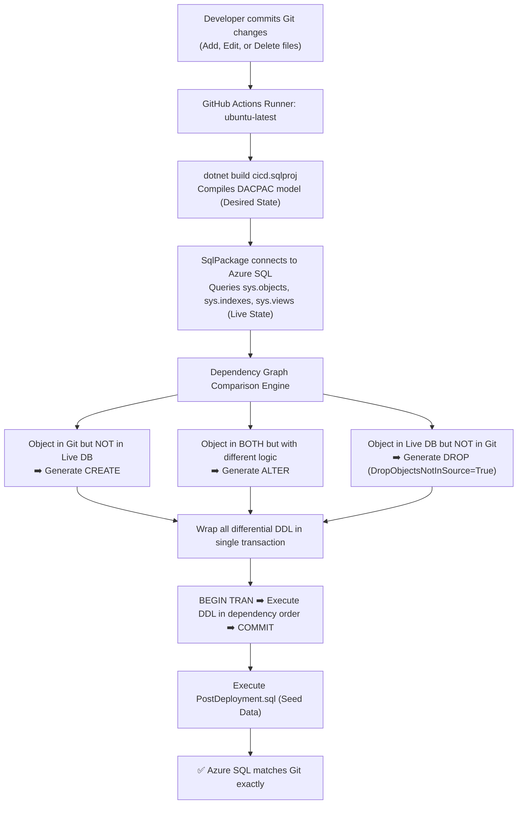

# 📖 Declarative Database Object Lifecycle Guide: Managing Tables, Views, SPs, Functions, Triggers & Indexes in Azure SQL CI/CD

> **Target Database Engine**: Azure SQL Database (`freetier-sqlserver-central.database.windows.net / appdb`)  
> **Architecture**: 100% CLI-Driven State-Based CI/CD (`.NET SDK` + `SqlPackage` on Ubuntu Runner)  
> **Core Concept**: **Declarative / Desired-State Model** — Git is the single source of truth.

---

## 📑 Table of Contents

1. [Declarative (State-Based) vs Imperative (Migration-Based)](#-1-declarative-state-based-vs-imperative-migration-based)
2. [The Golden Rules of Declarative SQL Projects](#-2-the-golden-rules-of-declarative-sql-projects)
3. [Master Object Lifecycle Matrix](#-3-master-object-lifecycle-matrix)
4. [Deep Dive: Object-by-Object Management](#-4-deep-dive-object-by-object-management)
   - [👁️ Views](#️-views)
   - [⚡ Stored Procedures](#-stored-procedures)
   - [🎯 Triggers](#-triggers)
   - [🧮 Functions (Scalar & Table-Valued)](#-functions-scalar--table-valued)
   - [🔍 Indexes (Standalone vs Inline)](#-indexes-standalone-vs-inline)
   - [📦 Tables & Columns](#-tables--columns)
   - [🏢 Schemas](#-schemas)
5. [The 3 Critical SqlPackage Deployment Flags](#-5-the-3-critical-sqlpackage-deployment-flags)
6. [How the Delta Engine Works Internally](#-6-how-the-delta-engine-works-internally)
7. [Step-by-Step Developer Workflows with Git](#-7-step-by-step-developer-workflows-with-git)
8. [Azure SQL Verification Queries](#-8-azure-sql-verification-queries)

---

## 🏛️ 1. Declarative (State-Based) vs Imperative (Migration-Based)

```
┌──────────────────────────────────────────────────────────┬──────────────────────────────────────────────────────────┐
│ ❌ Imperative / Migration-Based (Flyway, Liquibase, EF)   │ ✅ Declarative / State-Based (DACPAC / SqlPackage / This) │
├──────────────────────────────────────────────────────────┼──────────────────────────────────────────────────────────┤
│ Developer writes transition scripts:                     │ Developer defines the DESIRED END-STATE only:            │
│ • V1__create_table.sql                                   │ • dbo/Tables/EmployeeDummy.sql                           │
│ • V2__add_column.sql                                     │ • dbo/Views/vw_ActiveEmployees.sql                       │
│ • V3__drop_index.sql                                     │ • dbo/StoredProcedures/GetEmployeeDetails.sql            │
│                                                          │                                                          │
│ Hard to know what the current schema looks like.         │ The Git repository IS the live schema model.             │
│ Developers must write manual rollback scripts.           │ SqlPackage automatically calculates and executes diffs.  │
│ Clutters repo with hundreds of historical migration files│ Clean, modular directory structure organized by component│
└──────────────────────────────────────────────────────────┴──────────────────────────────────────────────────────────┘
```

---

## 📜 2. The Golden Rules of Declarative SQL Projects

1. **Always Use `CREATE` in Code**:
   Never write `ALTER PROCEDURE`, `ALTER VIEW`, or `ALTER TABLE` in your repository files. Always write `CREATE ...`. When deploying, `SqlPackage` automatically inspects Azure SQL and decides whether to issue `CREATE`, `ALTER`, or `REBUILD`.

2. **To Remove an Object, Delete the File**:
   Never write manual `DROP` scripts. Deleting `dbo/Views/vw_ActiveEmployees.sql` from Git tells `SqlPackage` that the view is no longer desired, and it will execute `DROP VIEW` on Azure SQL automatically.

3. **Git History is the Audit Trail**:
   Instead of keeping historical migration files, use `git log -p dbo/Tables/Employees.sql` or `git blame` to see full schema evolution over time.

---

## 📊 3. Master Object Lifecycle Matrix

| Object Type | To ADD | To MODIFY (Update Logic) | To REMOVE |
| :--- | :--- | :--- | :--- |
| **👁️ Views** | Create `.sql` file in `dbo/Views/` or `<schema>/Views/` | Edit the `.sql` file (keep `CREATE VIEW`) | **Delete the `.sql` file** from Git |
| **⚡ Stored Procedures**| Create `.sql` file in `StoredProcedures/` | Edit the `.sql` file (keep `CREATE PROCEDURE`) | **Delete the `.sql` file** from Git |
| **🎯 Triggers** | Create `.sql` file in `dbo/Triggers/` | Edit the `.sql` file (keep `CREATE TRIGGER`) | **Delete the `.sql` file** from Git |
| **🧮 Functions** | Create in `dbo/Functions/Scalar/` or `TableValued/` | Edit the `.sql` file (keep `CREATE FUNCTION`) | **Delete the `.sql` file** from Git |
| **🔍 Standalone Indexes**| Create `.sql` file in `dbo/Indexes/` | Edit index columns/options in file | **Delete the `.sql` file** from Git |
| **🔍 Inline Indexes**| Add `CREATE INDEX` at bottom of table file | Edit index definition in table file | **Delete the `CREATE INDEX` block** in table file |
| **📦 Tables** | Create `.sql` file in `dbo/Tables/` | Edit column/constraint definitions in table file | **Delete the `.sql` file** from Git |
| **🏢 Schemas** | Create `Security/Schemas/<Name>.sql` | Rename schema file/definition | **Delete the schema `.sql` file** from Git |

---

## 🔍 4. Deep Dive: Object-by-Object Management

### 👁️ Views
* **Location**: `dbo/Views/` or `<schema>/Views/` (e.g., [`dbo/Views/vw_ActiveEmployees.sql`](file:///Users/rohitjha/Documents/Git-master/SQL-CICD/dbo/Views/vw_ActiveEmployees.sql), [`sales/Views/vw_HighValueOrders.sql`](file:///Users/rohitjha/Documents/Git-master/SQL-CICD/sales/Views/vw_HighValueOrders.sql))
* **How SqlPackage handles it**:
  - **Adding**: Executes `CREATE VIEW [schema].[vw_Name] AS ...`.
  - **Modifying**: Compares SELECT statement against live catalog. If changed, executes `ALTER VIEW [schema].[vw_Name] AS ...`.
  - **Deleting**: Detects missing view file $\to$ Executes `DROP VIEW [schema].[vw_Name]`.

---

### ⚡ Stored Procedures
* **Location**: `dbo/StoredProcedures/` or `<schema>/StoredProcedures/` (e.g., [`dbo/StoredProcedures/GetEmployeeDetails.sql`](file:///Users/rohitjha/Documents/Git-master/SQL-CICD/dbo/StoredProcedures/GetEmployeeDetails.sql))
* **How SqlPackage handles it**:
  - **Adding**: Executes `CREATE PROCEDURE [schema].[ProcName] ...`.
  - **Modifying**: Executes `ALTER PROCEDURE [schema].[ProcName] ...` with updated parameters and logic.
  - **Deleting**: Detects missing procedure file $\to$ Executes `DROP PROCEDURE [schema].[ProcName]`.

---

### 🎯 Triggers
* **Location**: `dbo/Triggers/` (e.g., [`dbo/Triggers/trg_AuditEmployeeChanges.sql`](file:///Users/rohitjha/Documents/Git-master/SQL-CICD/dbo/Triggers/trg_AuditEmployeeChanges.sql))
* **How SqlPackage handles it**:
  - **Adding**: Attaches the trigger to the target table via `CREATE TRIGGER`.
  - **Modifying**: Updates trigger body via `ALTER TRIGGER`.
  - **Deleting**: Executes `DROP TRIGGER [dbo].[trg_Name]`.
  - **Data Safety**: Dropping or updating a trigger **never** modifies or locks the underlying table's data.

---

### 🧮 Functions (Scalar & Table-Valued)
* **Location**: `dbo/Functions/Scalar/` or `dbo/Functions/TableValued/`
* **How SqlPackage handles it**:
  - **Adding**: Executes `CREATE FUNCTION ...`.
  - **Modifying**: Executes `ALTER FUNCTION ...`.
  - **Deleting**: Executes `DROP FUNCTION ...`.
  - **Dependency Protection**: If a computed column or view references the function, SqlPackage manages the drop/create sequence in the correct dependency order.

---

### 🔍 Indexes (Standalone vs Inline)

You have two clean options for indexes:

#### Option A: Standalone File (e.g., `dbo/Indexes/IX_EmployeeDummy_Department.sql`)
```sql
CREATE NONCLUSTERED INDEX [IX_EmployeeDummy_Department]
    ON [dbo].[EmployeeDummy] ([Department] ASC);
GO
```
- **To Drop**: Delete `IX_EmployeeDummy_Department.sql` $\to$ SqlPackage runs `DROP INDEX [IX_EmployeeDummy_Department] ON [dbo].[EmployeeDummy];`.

#### Option B: Inline in Table File (e.g., `dbo/Tables/Projects.sql`)
```sql
CREATE TABLE [dbo].[Projects] (
    [ProjectID] INT IDENTITY(1,1) PRIMARY KEY,
    [DepartmentID] INT NOT NULL
);
GO

CREATE NONCLUSTERED INDEX [IX_Projects_DepartmentID]
    ON [dbo].[Projects] ([DepartmentID] ASC);
GO
```
- **To Drop**: Delete the `CREATE NONCLUSTERED INDEX` block from `Projects.sql` $\to$ SqlPackage drops the index while keeping the table intact.

---

### 📦 Tables & Columns
* **Location**: `dbo/Tables/` or `<schema>/Tables/`
* **Adding a Column**: Add `[NewColumn] NVARCHAR(50) NULL` to table file $\to$ SqlPackage issues `ALTER TABLE ADD [NewColumn]`.
* **Dropping a Column**: Delete column from table file $\to$ SqlPackage issues `ALTER TABLE DROP COLUMN` (allowed because `/p:BlockOnPossibleDataLoss=False` is set).
* **Adding `NOT NULL` Column**: SqlPackage generates smart defaults during table rebuild (allowed because `/p:GenerateSmartDefaults=True` is set).
* **Dropping a Table**: Delete table `.sql` file $\to$ SqlPackage issues `DROP TABLE`.

---

## ⚙️ 5. The 3 Critical SqlPackage Deployment Flags

In [`.github/workflows/main.yml`](file:///Users/rohitjha/Documents/Git-master/SQL-CICD/.github/workflows/main.yml) and [`deploy_cli.sh`](file:///Users/rohitjha/Documents/Git-master/SQL-CICD/deploy_cli.sh), these three parameters control the entire declarative automation:

```yaml
sqlpackage \
  /Action:Publish \
  /SourceFile:"./bin/Release/cicd.dacpac" \
  /TargetConnectionString:"${{ secrets.SQL_CONNECTION_STRING }}" \
  /p:BlockOnPossibleDataLoss=False \
  /p:GenerateSmartDefaults=True \
  /p:DropObjectsNotInSource=True
```

### What Each Flag Does:

| Flag | Value | Why It Is Essential |
| :--- | :--- | :--- |
| **`/p:DropObjectsNotInSource`** | `True` | **Enables automatic deletion**: When you delete any Table, View, SP, Function, Trigger, or Index from Git, SqlPackage automatically executes `DROP` in Azure SQL. |
| **`/p:BlockOnPossibleDataLoss`** | `False` | **Permits schema refactoring**: Allows dropping columns or tables with data during agile development without crashing the pipeline. |
| **`/p:GenerateSmartDefaults`** | `True` | **Handles table migrations**: Auto-generates placeholder defaults when copying existing rows into a new `NOT NULL` column during table rebuilds. |

---

## 🔄 6. How the Delta Engine Works Internally



---

## 👩‍💻 7. Step-by-Step Developer Workflows with Git

### Scenario 1: Creating a New View
```bash
# 1. Create view file
cat << 'EOF' > dbo/Views/vw_DepartmentBudgets.sql
CREATE VIEW [dbo].[vw_DepartmentBudgets]
AS
    SELECT DepartmentName, Budget FROM dbo.Departments WHERE IsActive = 1;
GO
EOF

# 2. Commit and push
git add dbo/Views/vw_DepartmentBudgets.sql
git commit -m "Add vw_DepartmentBudgets view"
git push origin main
# 🚀 Pipeline auto-creates view in Azure SQL
```

---

### Scenario 2: Modifying an Existing Stored Procedure
```bash
# 1. Edit dbo/StoredProcedures/GetEmployeeDetails.sql in your editor
# (Keep CREATE PROCEDURE in file — do NOT change to ALTER)

# 2. Commit and push
git add dbo/StoredProcedures/GetEmployeeDetails.sql
git commit -m "Update GetEmployeeDetails stored procedure logic"
git push origin main
# 🚀 Pipeline auto-runs ALTER PROCEDURE in Azure SQL
```

---

### Scenario 3: Deleting an Index or Trigger
```bash
# 1. Delete the file from Git
git rm dbo/Indexes/IX_EmployeeDummy_Department.sql

# 2. Commit and push
git commit -m "Drop IX_EmployeeDummy_Department index"
git push origin main
# 🚀 Pipeline auto-runs DROP INDEX in Azure SQL
```

---

## 🧪 8. Azure SQL Verification Queries

Run these queries in **Azure Portal Query Editor** or **SSMS** to inspect your live database state:

### 1. Check all Views in Database
```sql
SELECT SCHEMA_NAME(schema_id) AS [Schema], name AS ViewName, create_date, modify_date
FROM sys.views
ORDER BY [Schema], name;
```

### 2. Check all Stored Procedures
```sql
SELECT SCHEMA_NAME(schema_id) AS [Schema], name AS ProcedureName, create_date, modify_date
FROM sys.procedures
ORDER BY [Schema], name;
```

### 3. Check all Triggers
```sql
SELECT 
    t.name AS TriggerName,
    OBJECT_NAME(t.parent_id) AS TableName,
    t.is_disabled AS IsDisabled
FROM sys.triggers t;
```

### 4. Check all Indexes on a Table
```sql
SELECT 
    t.name AS TableName,
    i.name AS IndexName,
    i.type_desc AS IndexType,
    i.is_primary_key AS IsPK,
    i.is_unique AS IsUnique
FROM sys.indexes i
JOIN sys.tables t ON i.object_id = t.object_id
WHERE t.name = 'EmployeeDummy';
```

---

*Document Version: 1.0 — Declarative Database Object Lifecycle Guide*  
*Target Environment: Azure SQL Database (`appdb`)*
