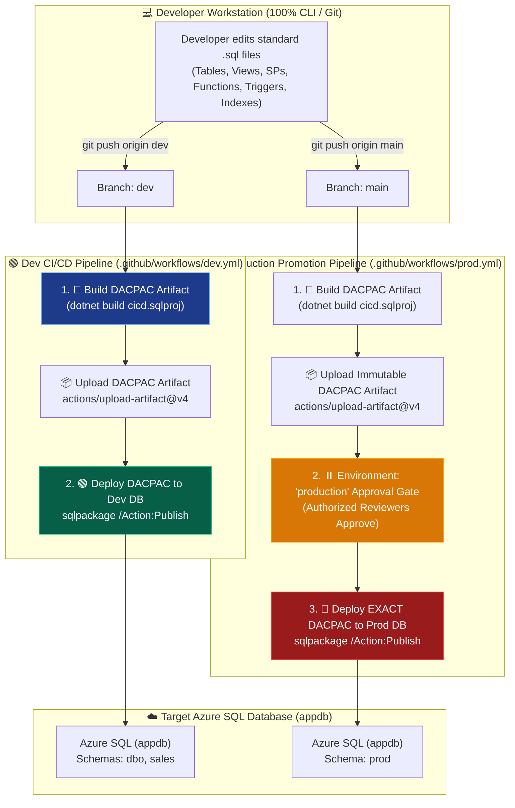
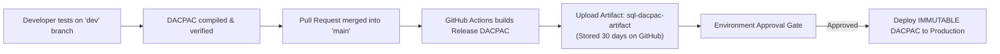

# 🏛️ Enterprise Azure SQL Database CI/CD: 100% CLI-Driven Multi-Schema & Multi-Environment Architecture Master Guide

> **Target Database Engine**: Azure SQL Database (`freetier-sqlserver-central.database.windows.net / appdb`)  
> **CI/CD Platform**: GitHub Actions (`ubuntu-latest` Linux Runners)  
> **Toolchain**: .NET 8.0 SDK, `Microsoft.Build.Sql` SDK v2.2.0, `SqlPackage` (Global CLI Tool)  
> **Deployment Pattern**: **Declarative Desired-State** + **Immutable DACPAC Artifact Promotion ("Build Once, Deploy Many")**  
> **Author / Repository**: `rohitjha20/SQL-CICD`  
> **Last Updated**: 14 August 2026  

---

## 📑 Table of Contents

1. [Executive Architectural Blueprint](#-1-executive-architectural-blueprint)
2. [Complete Repository Directory Structure](#-2-complete-repository-directory-structure)
3. [Multi-Schema Domain Architecture (`dbo`, `sales`, `prod`)](#-3-multi-schema-domain-architecture-dbo-sales-prod)
4. [Dual-Pipeline Branching Strategy (Dev vs Prod Promotion)](#-4-dual-pipeline-branching-strategy-dev-vs-prod-promotion)
5. [The DACPAC Artifact Promotion Pattern ("Build Once, Deploy Many")](#-5-the-dacpac-artifact-promotion-pattern-build-once-deploy-many)
6. [Declarative Database Object Lifecycle (Add, Modify, Drop)](#-6-declarative-database-object-lifecycle-add-modify-drop)
7. [The 3 Critical `SqlPackage` Guardrail Deployment Flags](#-7-the-3-critical-sqlpackage-guardrail-deployment-flags)
8. [Post-Deployment Idempotent Data Seeding Orchestration](#-8-post-deployment-idempotent-data-seeding-orchestration)
9. [Automated Multi-Schema Testing Framework (14 Tests)](#-9-automated-multi-schema-testing-framework-14-tests)
10. [Database Teardown & Reset Engine (`cleanup_appdb.sql`)](#-10-database-teardown--reset-engine-cleanup_appdbsql)
11. [Developer Operational Playbook (Step-by-Step Cheatsheet)](#-11-developer-operational-playbook-step-by-step-cheatsheet)

---

## 🏗️ 1. Executive Architectural Blueprint

This project establishes an **enterprise-standard, 100% CLI-driven CI/CD framework** for Azure SQL Database that removes all dependencies on local desktop IDE extensions (such as Visual Studio SQL Server Data Tools or Azure Data Studio extensions). 



### Core Tenets of the System:
- **Zero Local Tooling Bloat**: Developers only write pure T-SQL `.sql` files. No `.sqlproj` is needed locally; project configuration and DACPAC compilation happen dynamically in CI/CD.
- **Cross-Platform Linux Execution**: All builds, artifact packagings, and deployments run on `ubuntu-latest` GitHub Actions runners.
- **State-Based Declarative Engine**: Git represents the **Desired End State**. Adding a file creates the object; editing a file alters the object; deleting a file automatically drops the object.

---

## 📁 2. Complete Repository Directory Structure

```
SQL-CICD/
├── .github/
│   └── workflows/
│       ├── dev.yml                          # Dev Pipeline: Build -> Deploy to Dev
│       └── prod.yml                         # Prod Pipeline: Build -> Approval Gate -> Promote to Prod
├── Security/
│   └── Schemas/
│       ├── Sales.sql                        # CREATE SCHEMA [sales];
│       └── Prod.sql                         # CREATE SCHEMA [prod];
├── dbo/                                     # DBO Schema Components (Core HR & Operations)
│   ├── Tables/
│   │   ├── EmployeeDummy.sql                # Employee table with Designation, Contact, Salary
│   │   ├── persondetails.sql                # Person reference table with Contact & City
│   │   ├── SchemaEvolutionDemo.sql          # Table demonstrating PK, Unique, CHECK & Defaults
│   │   ├── AuditLog.sql                     # Historical audit log table
│   │   ├── Departments.sql                  # Department lookup table with Budget
│   │   └── Projects.sql                     # Projects table with CHECK & Date constraints
│   ├── Views/
│   │   └── vw_ActiveEmployees.sql           # Active employee filter view
│   ├── Functions/
│   │   ├── Scalar/
│   │   │   └── fn_CalculateBonus.sql        # Department bonus percentage calculator
│   │   └── TableValued/
│   │       └── fn_GetEmployeesByDepartment.sql # Department row filter function
│   ├── Triggers/
│   │   └── trg_AuditEmployeeChanges.sql     # AFTER INSERT/UPDATE/DELETE audit logger
│   ├── Indexes/
│   │   └── IX_EmployeeDummy_Department.sql  # Standalone nonclustered index on Department
│   └── StoredProcedures/
│       └── GetEmployeeDetails.sql           # Parameterized employee retrieval procedure
├── sales/                                   # SALES Schema Components (E-Commerce Domain)
│   ├── Tables/
│   │   ├── Customers.sql                    # Customers table with Unique CustomerCode & Email
│   │   └── Orders.sql                       # Orders table with status CHECK constraint & Index
│   ├── Views/
│   │   └── vw_HighValueOrders.sql           # High-value orders view (Orders + Customers join)
│   └── StoredProcedures/
│       └── GetCustomerOrderSummary.sql      # Aggregated customer lifetime spend procedure
├── prod/                                    # PROD Schema Components (Replicated Prod Environment)
│   ├── Tables/
│   │   ├── AuditSummary.sql                 # Release version tracking table
│   │   ├── Configuration.sql                # Application environment key-value configuration
│   │   ├── EmployeeDummy.sql                # Replicated EmployeeDummy table
│   │   ├── persondetails.sql                # Replicated person table
│   │   ├── Departments.sql                  # Replicated Departments table
│   │   ├── Projects.sql                     # Replicated Projects table with CHECK constraints
│   │   ├── SchemaEvolutionDemo.sql          # Replicated SchemaEvolutionDemo table
│   │   └── AuditLog.sql                     # Replicated AuditLog table
│   ├── Views/
│   │   └── vw_ProductionHealth.sql          # Production release health monitor view
│   └── StoredProcedures/
│       └── LogProductionDeployment.sql      # Release version logger procedure
├── PostDeployment/                          # Post-Deployment Idempotent Seeding Orchestrator
│   ├── PostDeployment.sql                   # Master seed orchestrator (:r inclusion)
│   ├── Employeedummy.sql                    # Seed data for dbo.EmployeeDummy
│   ├── Persondata.sql                       # Seed data for dbo.person
│   ├── AuditLogSeed.sql                     # Seed data for dbo.AuditLog
│   ├── DepartmentSeed.sql                   # Seed data for dbo.Departments
│   ├── SalesSeed.sql                        # Seed data for sales.Customers & sales.Orders
│   └── ProdSeed.sql                         # Seed data for prod.Configuration & prod.Departments
├── tests/                                   # Automated SQL Test Suite
│   ├── run_all_tests.sql                    # 14 Automated SQL Test Cases (Assertion Engine)
│   ├── test_runner.sh                       # CLI test execution shell script
│   └── TEST_CASES_SPECIFICATION.md          # Comprehensive test matrix specification
├── cleanup_appdb.sql                        # Universal multi-schema database reset script
├── DECLARATIVE_DATABASE_OBJECT_LIFECYCLE_GUIDE.md # Deep-dive object lifecycle reference
├── STEP_BY_STEP_IMPLEMENTATION_GUIDE.md     # Step-by-step setup guide
├── PROJECT_WORK_SUMMARY.md                  # Project work log and history
└── README.md
```

---

## 🏛️ 3. Multi-Schema Domain Architecture (`dbo`, `sales`, `prod`)

The database is divided into **three logical schemas** to demonstrate multi-domain and multi-environment co-existence:

```
┌───────────────────────────────────────┬───────────────────────────────────────┬───────────────────────────────────────┐
│ 🟦 DBO Schema                         │ 🟨 SALES Schema                       │ 🟥 PROD Schema                        │
├───────────────────────────────────────┼───────────────────────────────────────┼───────────────────────────────────────┤
│ Core HR, Personnel & Projects:        │ E-Commerce & Commercial Domain:       │ Isolated Production Environment:      │
│ • dbo.EmployeeDummy (Table)           │ • sales.Customers (Table)             │ • prod.AuditSummary (Table)           │
│ • dbo.person (Table)                  │ • sales.Orders (Table)                │ • prod.Configuration (Table)          │
│ • dbo.Departments (Table)             │ • sales.vw_HighValueOrders (View)     │ • prod.EmployeeDummy (Table)          │
│ • dbo.Projects (Table)                │ • sales.GetCustomerOrderSummary (SP)  │ • prod.person (Table)                 │
│ • dbo.SchemaEvolutionDemo (Table)     │                                       │ • prod.Departments (Table)            │
│ • dbo.AuditLog (Table)                │                                       │ • prod.Projects (Table)               │
│ • dbo.vw_ActiveEmployees (View)       │                                       │ • prod.SchemaEvolutionDemo (Table)    │
│ • dbo.fn_CalculateBonus (Scalar Func) │                                       │ • prod.AuditLog (Table)               │
│ • dbo.fn_GetEmployeesByDept (TVF)     │                                       │ • prod.vw_ProductionHealth (View)     │
│ • dbo.trg_AuditEmployeeChanges (Trig) │                                       │ • prod.LogProductionDeployment (SP)   │
│ • dbo.GetEmployeeDetails (SP)         │                                       │                                       │
│ • dbo.IX_EmployeeDummy_Dept (Index)   │                                       │                                       │
└───────────────────────────────────────┴───────────────────────────────────────┴───────────────────────────────────────┘
```

---

## 🔀 4. Dual-Pipeline Branching Strategy (Dev vs Prod Promotion)

We decoupled continuous integration into **two isolated, purpose-built workflows**:

### 1. Dev Branch Pipeline ([`.github/workflows/dev.yml`](file:///Users/rohitjha/Documents/Git-master/SQL-CICD/.github/workflows/dev.yml))
* **Trigger**: `push` to `dev` branch.
* **Execution Flow**:
  1. `🔨 Build DACPAC Artifact`: Compiles T-SQL into `cicd.dacpac` using .NET 8 on Ubuntu.
  2. `📦 Upload Artifact`: Archives `cicd.dacpac` as `sql-dacpac-artifact`.
  3. `🟢 Deploy to Dev`: Publishes the DACPAC directly to the Development database/schema.
* **UI Graph**: Clean 2-node graph — **zero production nodes or skipped clutter**.

### 2. Production Promotion Pipeline ([`.github/workflows/prod.yml`](file:///Users/rohitjha/Documents/Git-master/SQL-CICD/.github/workflows/prod.yml))
* **Trigger**: `push` / merge to `main` branch.
* **Execution Flow**:
  1. `🔨 Build DACPAC Artifact`: Compiles release package.
  2. `📦 Upload Artifact`: Uploads release artifact.
  3. `⏸️ Production Approval Gate`: Pauses execution under GitHub Environment `production` for authorized reviewer sign-off.
  4. `🔴 Promote to Production`: Deploys the approved DACPAC to the Production database.

---

## 📦 5. The DACPAC Artifact Promotion Pattern ("Build Once, Deploy Many")



### Why This is Enterprise Best Practice:
1. **Binary Immutability**: Production runs the **exact binary artifact** validated in pre-prod.
2. **Audit & Compliance**: Every production deployment links directly to a verifiable DACPAC build artifact in GitHub Actions.
3. **Rollback Ready**: Any previous release artifact can be downloaded and republished immediately via `sqlpackage /Action:Publish /SourceFile:release-v1.0.dacpac`.

---

## 📜 6. Declarative Database Object Lifecycle (Add, Modify, Drop)

In this repository, **Git is the Single Source of Truth**. You never write manual migration scripts.

```
┌───────────────────────┬──────────────────────────────────┬──────────────────────────────────┐
│ Object Type           │ To ADD / MODIFY                  │ To REMOVE                        │
├───────────────────────┼──────────────────────────────────┼──────────────────────────────────┤
│ 👁️ Views              │ Create/Edit file in dbo/Views/   │ Delete the .sql file from Git    │
│ ⚡ Stored Procedures  │ Create/Edit in StoredProcedures/ │ Delete the .sql file from Git    │
│ 🎯 Triggers           │ Create/Edit in dbo/Triggers/     │ Delete the .sql file from Git    │
│ 🧮 Functions          │ Create/Edit in dbo/Functions/    │ Delete the .sql file from Git    │
│ 🔍 Indexes            │ Create/Edit in dbo/Indexes/      │ Delete the .sql file from Git    │
│ 📦 Tables             │ Create/Edit in dbo/Tables/       │ Delete the .sql file from Git    │
└───────────────────────┴──────────────────────────────────┴──────────────────────────────────┘
```

---

## ⚙️ 7. The 3 Critical `SqlPackage` Guardrail Deployment Flags

Located in `.github/workflows/dev.yml` and `.github/workflows/prod.yml`:

```bash
sqlpackage \
  /Action:Publish \
  /SourceFile:"./cicd.dacpac" \
  /TargetConnectionString:"${{ secrets.SQL_CONNECTION_STRING }}" \
  /p:BlockOnPossibleDataLoss=False \
  /p:GenerateSmartDefaults=True \
  /p:DropObjectsNotInSource=True
```

| Flag | Value | Purpose & Real-World Behavior |
| :--- | :--- | :--- |
| **`/p:DropObjectsNotInSource`** | `True` | **Enables Auto-Drop**: When you delete any Table, View, SP, Trigger, or Index `.sql` file in Git, `SqlPackage` automatically executes `DROP` in Azure SQL. |
| **`/p:BlockOnPossibleDataLoss`** | `False` | **Permits Agile Refactoring**: Allows dropping columns or tables during active development without failing the CI/CD pipeline. |
| **`/p:GenerateSmartDefaults`** | `True` | **Handles Table Rebuilds**: Auto-generates placeholder defaults when adding `NOT NULL` columns to existing populated tables during table copy operations. |

---

## 🌱 8. Post-Deployment Idempotent Data Seeding Orchestration

[`PostDeployment/PostDeployment.sql`](file:///Users/rohitjha/Documents/Git-master/SQL-CICD/PostDeployment/PostDeployment.sql) acts as the master orchestrator executed immediately after schema synchronization:

```sql
:r ./Employeedummy.sql
:r ./Persondata.sql
:r ./AuditLogSeed.sql
:r ./DepartmentSeed.sql
:r ./SalesSeed.sql
:r ./ProdSeed.sql
```

Every script uses idempotent guards (`IF NOT EXISTS (...)`) to ensure seed data is only inserted once, making deployments completely safe on repeat runs.

---

## 🧪 9. Automated Multi-Schema Testing Framework (14 Tests)

Located in [`tests/run_all_tests.sql`](file:///Users/rohitjha/Documents/Git-master/SQL-CICD/tests/run_all_tests.sql), this transaction-safe assertion suite executes in Azure SQL and produces a structured test report:

```text
Test # | Component   | Test Scenario                               | What It Asserts
-------+-------------+---------------------------------------------+-------------------------------------------------------------
1      | Schema      | Verify All Multi-Schema Objects Exist       | Asserts 20 objects across dbo, sales, and prod exist
2      | Evolution   | Verify Designation Column in dbo & prod     | Asserts new Designation column exists in EmployeeDummy
3      | Tables      | SchemaEvolutionDemo Default Constraints     | Asserts Status='Active' and CreatedAt defaults
4      | Constraints | Negative Test: CHECK Constraint Rejection   | Asserts invalid status 'Suspended' fails (Error 547)
5      | PostDeploy  | Multi-Schema Seed Data Verification         | Asserts seed rows exist in person, Customers, Config
6      | Views       | vw_ActiveEmployees Status Filtering         | Asserts only Status='Active' rows are returned
7      | Functions   | fn_CalculateBonus Department Logic          | Asserts 15%, 12%, 13%, 10% bonus calculations
8      | Functions   | fn_GetEmployeesByDepartment Output          | Asserts TVF returns rows matching department filter
9      | Triggers    | Trigger Audit Log on INSERT                 | Asserts AFTER INSERT creates row in dbo.AuditLog
10     | Triggers    | Trigger Audit Log on UPDATE                 | Asserts AFTER UPDATE captures OldValues and NewValues
11     | SalesSchema | sales.vw_HighValueOrders Filter Validation  | Asserts orders >= 50,000 are returned in view
12     | SalesSchema | sales.GetCustomerOrderSummary Execution     | Asserts SP calculates total orders & lifetime spend
13     | ProdSchema  | prod.LogProductionDeployment & Health View  | Asserts release logging SP and health monitor view
14     | Constraints | CK_Projects_DateOrder Enforcement           | Asserts EndDate < StartDate is rejected (Error 547)
```

---

## 🧹 10. Database Teardown & Reset Engine (`cleanup_appdb.sql`)

Located in [`cleanup_appdb.sql`](file:///Users/rohitjha/Documents/Git-master/SQL-CICD/cleanup_appdb.sql):
- Drops all Triggers, Views, Stored Procedures, and Functions across all schemas.
- Drops all Foreign Key constraints dynamically.
- Drops all Tables in `prod`, `sales`, and `dbo` schemas in safe reverse-dependency order.
- Drops `prod` and `sales` schemas.

---

## 👩‍💻 11. Developer Operational Playbook (Step-by-Step Cheatsheet)

### 1. Adding a New Column
1. Open the table file (e.g., `dbo/Tables/EmployeeDummy.sql`).
2. Add the column: `[Designation] NVARCHAR(100) NULL,`.
3. Commit and push:
   ```bash
   git add dbo/Tables/EmployeeDummy.sql
   git commit -m "Add Designation column"
   git push origin dev
   ```

### 2. Modifying a Stored Procedure or View
1. Open the file (e.g., `dbo/Views/vw_ActiveEmployees.sql`).
2. Update the query (keep `CREATE VIEW`).
3. Commit and push:
   ```bash
   git add dbo/Views/vw_ActiveEmployees.sql
   git commit -m "Update active employees filter logic"
   git push origin dev
   ```

### 3. Deleting / Dropping an Object
1. Delete the file from Git:
   ```bash
   git rm dbo/Indexes/IX_EmployeeDummy_Department.sql
   git commit -m "Drop index"
   git push origin dev
   ```
   *(SqlPackage will automatically issue `DROP INDEX` on Azure SQL).*

### 4. Promoting Changes from Dev to Production
```bash
# 1. Switch to main and merge dev
git checkout main
git merge dev
git push origin main

# 2. Open GitHub Actions -> Click "Review Deployments" -> "Approve and Deploy"
# 🚀 DACPAC is promoted directly to Production!
```

---

*Master Architecture Guide — 100% CLI-Driven Azure SQL CI/CD Pipeline*  
*Target Environment: `freetier-sqlserver-central.database.windows.net / appdb`*
