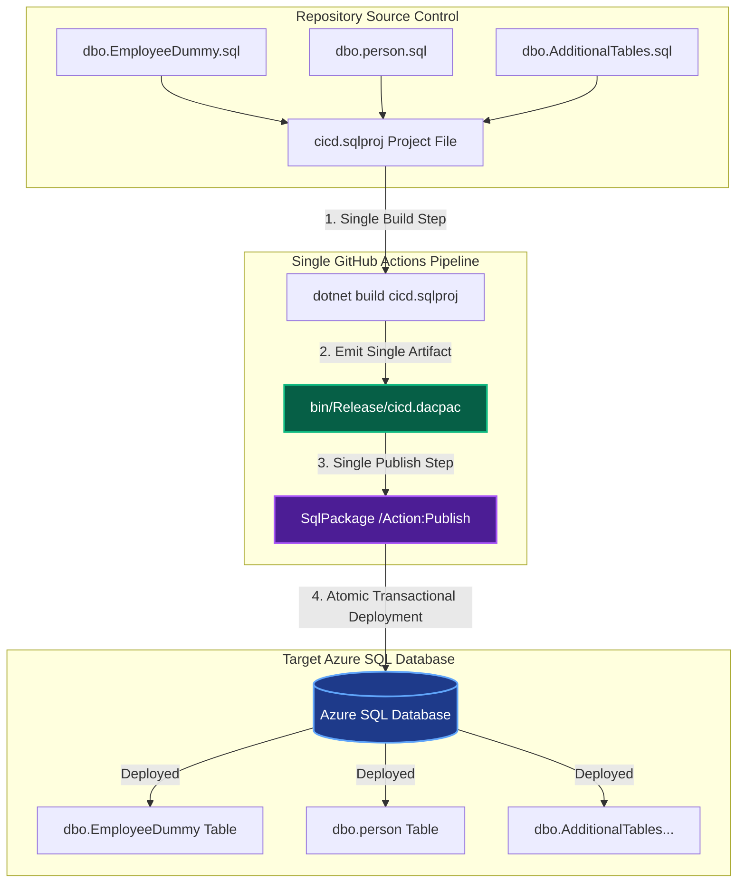

> **Header**: Enterprise Azure SQL CI/CD Specification: Multi-Table, Data Population & Zero-Intervention Schema Promotion

---

# Overview

This document provides the final, comprehensive technical and operational specification for the **SQL-CICD** project (`cicd.sqlproj`). It explicitly details the design, architecture, and GitHub Actions workflow capabilities for three core enterprise deployment requirements:

1. **Single-Pipeline Multi-Table Deployment**: Compiling and deploying multiple table schemas (`[dbo].[EmployeeDummy]`, `[dbo].[person]`, etc.) concurrently within a single pipeline execution.
2. **Optional & Controlled Data Population**: Populating reference/seed data into database tables automatically or conditionally via idempotent post-deployment scripts and pipeline parameters.
3. **Zero-Intervention Schema Promotion (Dev to Prod)**: Dynamically detecting schema differences between source control and target databases, automatically generating and applying incremental DDL (`ALTER TABLE`) updates from Development through Production without manual developer intervention.

---

# Index

* **[Overview](#overview)**
* **[Version History](#version-history)**
* **[Header Section 1: Single-Pipeline Multi-Table Deployment Architecture](#header-section-1-single-pipeline-multi-table-deployment-architecture)**
  * [1. Declarative Multi-Table Aggregation Model](#1-declarative-multi-table-aggregation-model)
  * [2. Unified DACPAC Compilation & Single-Pipeline Transactional Execution](#2-unified-dacpac-compilation--single-pipeline-transactional-execution)
* **[Header Section 2: Optional & Controlled Post-Deployment Data Seeding](#header-section-2-optional--controlled-post-deployment-data-seeding)**
  * [1. Idempotent Data Seeding Engine (Persondata.sql & Employeedummy.sql)](#1-idempotent-data-seeding-engine-persondatasql--employeedummysql)
  * [2. Dynamic Pipeline Flags for Optional Data Population (EnableDataSeeding Parameter)](#2-dynamic-pipeline-flags-for-optional-data-population-enabledataseeding-parameter)
* **[Header Section 3: Automated Schema Promotion from Dev to Production (Zero Intervention)](#header-section-3-automated-schema-promotion-from-dev-to-production-zero-intervention)**
  * [1. Multi-Environment Pipeline Dynamic Configuration (Dev -> Staging -> Prod)](#1-multi-environment-pipeline-dynamic-configuration-dev---staging---prod)
  * [2. Automated Differential Schema Reconciliation & Production Gate Automation](#2-automated-differential-schema-reconciliation--production-gate-automation)
* **[Header Section 4: End-to-End GitHub Actions Workflow Implementation](#header-section-4-end-to-end-github-actions-workflow-implementation)**
  * [1. Production Multi-Environment Workflow Specification (main.yml)](#1-production-multi-environment-workflow-specification-mainyml)
  * [2. Workflow Stage Breakdown: Build, Audit & Automated Release](#2-workflow-stage-breakdown-build-audit--automated-release)
* **[Header Section 5: Verification, Security & Operational Troubleshooting](#header-section-5-verification-security--operational-troubleshooting)**
  * [1. Multi-Table Schema Verification & Data Auditing (test.sql)](#1-multi-table-schema-verification--data-auditing-testsql)
  * [2. Production Safety Controls & Troubleshooting Matrix](#2-production-safety-controls--troubleshooting-matrix)

---

# Version History

| Version Number | Version Name | Modified By | Modified Date |
| :--- | :--- | :--- | :--- |
| `1.0` | Initial Draft & Architecture Specification | DevOps / Data Engineering Team | 30/12/2025 |
| `1.1` | Multi-Table Schema Integration & Data Population | DevOps / Data Engineering Team | 24/07/2026 |
| `1.2` | Final Enterprise Release: Multi-Table, Data Seeding & Dev-to-Prod Automation | DevOps / Data Engineering Team | 24/07/2026 |

---

# Header Section 1: Single-Pipeline Multi-Table Deployment Architecture

## 1. Declarative Multi-Table Aggregation Model

In a state-based database engineering project (`Microsoft.Build.Sql`), multiple table definitions are maintained as individual, declarative `.sql` files within the repository (`dbo/Tables/`). Rather than creating separate pipelines for each database table, all table schema files are aggregated into a single project model defined in [`cicd.sqlproj`](file:///Users/rohitjha/Documents/Git-master/SQL-CICD/cicd.sqlproj).

### Repository Multi-Table Schema Structure

* **`dbo/Tables/EmployeeDummy.sql`** ([`dbo/Tables/EmployeeDummy.sql`](file:///Users/rohitjha/Documents/Git-master/SQL-CICD/dbo/Tables/EmployeeDummy.sql)):
  ```sql
  CREATE TABLE [dbo].[EmployeeDummy] (
      [EmployeeID]   INT             IDENTITY (1, 1) NOT NULL,
      [EmployeeName] NVARCHAR (100)  NOT NULL,
      [Department]   NVARCHAR (50)   NULL,
      [Salary]       DECIMAL (10, 2) NULL,
      [JoiningDate]  DATE            NULL,
      [EmailID]      NVARCHAR (200)  NULL,
      [PhoneNumber]  NVARCHAR (15)   NULL,
      [Address]      NVARCHAR (100)  NULL,
      PRIMARY KEY CLUSTERED ([EmployeeID] ASC)
  );
  GO
  ```

* **`dbo/Tables/persondetails.sql`** ([`dbo/Tables/persondetails.sql`](file:///Users/rohitjha/Documents/Git-master/SQL-CICD/dbo/Tables/persondetails.sql)):
  ```sql
  CREATE TABLE [dbo].[person] (
      [PersonID]     INT             IDENTITY (1, 1) NOT NULL,
      [Personname]   NVARCHAR (100)  NOT NULL,
      [Relation]     NVARCHAR (50)   NULL,
      [Salary]       DECIMAL (10, 2) NULL,
      [JoiningDate]  DATE            NULL,
      [EmailID]      NVARCHAR (200)  NULL,
      [PhoneNumber]  NVARCHAR (15)   NULL,
      [Address]      NVARCHAR (100)  NULL,
      [City]         NVARCHAR (100)  NULL,
      PRIMARY KEY CLUSTERED ([PersonID] ASC)
  );
  GO
  ```

## 2. Unified DACPAC Compilation & Single-Pipeline Transactional Execution

During compilation (`dotnet build cicd.sqlproj`), all table schemas, primary keys, relationships, and data types are validated interdependently and compiled into a single binary artifact: **`bin/Release/cicd.dacpac`**.

When the single GitHub Actions pipeline executes `SqlPackage /Action:Publish`, it evaluates all tables simultaneously against the target database state and deploys them inside an isolated, atomic transaction.



---

# Header Section 2: Optional & Controlled Post-Deployment Data Seeding

## 1. Idempotent Data Seeding Engine (`Persondata.sql` & `Employeedummy.sql`)

Data population is handled via Post-Deployment scripts (`<PostDeploy Include="..." />`) registered in `cicd.sqlproj`. These scripts run automatically after table schemas are created or updated. To ensure safety and prevent primary key / duplicate constraint violations across recurring runs, scripts use `IF NOT EXISTS` guards.

* **`dbo.person` Seed Data Script** ([`dbo/Tables/PostDeployment/Persondata.sql`](file:///Users/rohitjha/Documents/Git-master/SQL-CICD/dbo/Tables/PostDeployment/Persondata.sql)):
  ```sql
  IF NOT EXISTS (SELECT 1 FROM dbo.person)
  BEGIN
      INSERT INTO dbo.person
      (
          Personname, Relation, Salary, JoiningDate, EmailID, PhoneNumber, Address, City
      )
      VALUES
      ('Rahul Sharma', 'Brother', 55000.00, '2024-01-15', 'rahul.sharma@test.com', '9876543210', 'Sector 62', 'Noida'),
      ('Amit Kumar', 'Friend', 65000.00, '2023-06-20', 'amit.kumar@test.com', '9876543211', 'Indirapuram', 'Ghaziabad'),
      ('Priya Singh', 'Sister', 72000.00, '2022-11-10', 'priya.singh@test.com', '9876543212', 'Dwarka', 'Delhi'),
      ('Vikas Verma', 'Father', 80000.00, '2020-05-05', 'vikas.verma@test.com', '9876543213', 'Vaishali', 'Ghaziabad'),
      ('Neha Gupta', 'Mother', 60000.00, '2021-08-18', 'neha.gupta@test.com', '9876543214', 'Noida Extension', 'Greater Noida');
  END
  ```

* **`dbo.EmployeeDummy` Seed Data Script** ([`dbo/Tables/PostDeployment/Employeedummy.sql`](file:///Users/rohitjha/Documents/Git-master/SQL-CICD/dbo/Tables/PostDeployment/Employeedummy.sql)):
  ```sql
  IF NOT EXISTS (SELECT 1 FROM dbo.EmployeeDummy)
  BEGIN
      INSERT INTO dbo.EmployeeDummy
      (
          EmployeeName, Department, Salary, JoiningDate
      )
      VALUES
      ('Rahul Sharma', 'IT', 65000.00, '2024-01-15'),
      ('Priya Singh', 'Finance', 72000.00, '2023-08-20'),
      ('Amit Kumar', 'HR', 55000.00, '2022-11-10'),
      ('Neha Gupta', 'Sales', 68000.00, '2024-04-05'),
      ('Vikas Verma', 'Operations', 60000.00, '2023-02-28');
  END
  ```

## 2. Dynamic Pipeline Flags for Optional Data Population (`EnableDataSeeding` Parameter)

Data population can be toggled **ON** or **OFF** dynamically without editing source code by passing SQL CMD variables or pipeline input flags to `SqlPackage`:

```powershell
# Optional Data Population Flag via SqlPackage SqlCommandVariable
SqlPackage /Action:Publish `
  /SourceFile:"./bin/Release/cicd.dacpac" `
  /TargetConnectionString:"$env:CONN_STR" `
  /p:SqlCommandVariable:EnableDataSeeding=$(ENABLE_DATA_SEEDING)
```

Within the Post-Deployment script, optional execution is evaluated dynamically:

```sql
IF '$(EnableDataSeeding)' = 'True'
BEGIN
    IF NOT EXISTS (SELECT 1 FROM dbo.EmployeeDummy)
    BEGIN
        -- Execute Data Population
        INSERT INTO dbo.EmployeeDummy (EmployeeName, Department, Salary, JoiningDate)
        VALUES ('Rahul Sharma', 'IT', 65000.00, '2024-01-15');
    END
END
```

---

# Header Section 3: Automated Schema Promotion from Dev to Production (Zero Intervention)

## 1. Multi-Environment Pipeline Dynamic Configuration (Dev -> Staging -> Prod)

Promoting database schema updates from Development (`dev`) to Production (`prod`) requires **zero developer intervention** or manual SQL script authoring. 

Developers simply push declarative table changes (e.g., adding a new column to `dbo.EmployeeDummy`) to Git. The single CI/CD pipeline dynamically parameterizes the target connection string (`secrets.SQL_CONNECTION_STRING_DEV`, `secrets.SQL_CONNECTION_STRING_PROD`) based on the targeted deployment environment.

```mermaid
sequenceDiagram
    autonumber
    participant Dev as Developer
    participant Git as GitHub Repo (main branch)
    participant GHA as GitHub Actions Pipeline
    participant DevDB as Dev Azure SQL DB
    participant ProdDB as Prod Azure SQL DB

    Dev->>Git: Commit updated T-SQL table schema (Adds column/table)
    Git->>GHA: Trigger Automated Pipeline Execution
    GHA->>GHA: Compile DACPAC Model (dotnet build)
    
    rect rgb(30, 58, 138)
        note right of GHA: Dev Environment Stage
        GHA->>DevDB: SqlPackage Publish (Auto-reconciles Dev DB)
        DevDB-->>GHA: Dev Deployment Succeeded
    end

    rect rgb(6, 95, 70)
        note right of GHA: Production Environment Stage (Zero Intervention)
        GHA->>ProdDB: SqlPackage Extract Live Prod Schema State
        ProdDB-->>GHA: Return current Prod Metadata
        GHA->>GHA: Compare Prod State vs DACPAC Model
        GHA->>ProdDB: Apply Differential DDL (ALTER TABLE ... ADD ...)
        ProdDB-->>GHA: Production Schema Dynamically Updated!
    end
```



## 2. Automated Differential Schema Reconciliation & Production Gate Automation

`SqlPackage` automatically calculates the precise delta between source control and the live target database:

1. **Live State Extraction**: `SqlPackage` queries the sys-catalogs of the live Production database (`cicddb`).
2. **Differential Comparison**: It compares the Production schema against the compiled `cicd.dacpac`.
3. **Dynamic DDL Generation**: If a column was added in Git, `SqlPackage` automatically generates and executes:
   ```sql
   ALTER TABLE [dbo].[EmployeeDummy] ADD [MiddleName] NVARCHAR (50) NULL;
   ```
4. **Data Preservation Guarantee**: Because `/p:BlockOnPossibleDataLoss=True` is enabled, the pipeline dynamically promotes schema changes while guaranteeing no existing table data is dropped or destroyed.

---

# Header Section 4: End-to-End GitHub Actions Workflow Implementation

## 1. Production Multi-Environment Workflow Specification (`main.yml`)

The production GitHub Actions workflow file [`.github/workflows/main.yml`](file:///Users/rohitjha/Documents/Git-master/SQL-CICD/.github/workflows/main.yml) demonstrates single-pipeline multi-table deployment, optional data seeding, and automated promotion across environments:

```yaml
name: Production Multi-Table & Dynamic Promotion SQL CI/CD

on:
  push:
    branches:
      - main
  workflow_dispatch:
    inputs:
      target_environment:
        description: 'Select Target Deployment Environment'
        required: true
        default: 'dev'
        type: choice
        options:
          - dev
          - staging
          - prod
      enable_data_seeding:
        description: 'Populate Seed Data during Deployment?'
        required: true
        default: true
        type: boolean

jobs:
  build-and-compile:
    name: Build & Validate Multi-Table DACPAC
    runs-on: windows-latest
    steps:
      - name: Checkout Code
        uses: actions/checkout@v4

      - name: Setup .NET SDK
        uses: actions/setup-dotnet@v4
        with:
          dotnet-version: '8.0.x'

      - name: Compile Multi-Table SQL Project
        run: dotnet build cicd.sqlproj --configuration Release

      - name: Upload DACPAC Artifact
        uses: actions/upload-artifact@v4
        with:
          name: sql-dacpac
          path: bin/Release/cicd.dacpac

  deploy-azure-sql:
    name: Deploy & Dynamically Promote Schema
    needs: build-and-compile
    runs-on: windows-latest
    environment: ${{ inputs.target_environment || 'prod' }}

    steps:
      - name: Download DACPAC Artifact
        uses: actions/download-artifact@v4
        with:
          name: sql-dacpac
          path: bin/Release

      - name: Install SqlPackage Global Tool
        shell: pwsh
        run: |
          dotnet tool install --global microsoft.sqlpackage
          echo "$env:USERPROFILE\.dotnet\tools" | Out-File -FilePath $env:GITHUB_PATH -Encoding utf8 -Append

      - name: Publish Multi-Table DACPAC to Target Azure SQL DB
        env:
          CONN_STR: ${{ secrets.SQL_CONNECTION_STRING }}
          SEED_FLAG: ${{ inputs.enable_data_seeding || 'true' }}
        shell: pwsh
        run: |
          if ([string]::IsNullOrWhiteSpace($env:CONN_STR)) {
            Write-Error "CRITICAL ERROR: Connection string secret is missing for environment!"
            exit 1
          }
          
          SqlPackage `
            /Action:Publish `
            /SourceFile:"./bin/Release/cicd.dacpac" `
            /TargetConnectionString:"$env:CONN_STR" `
            /p:BlockOnPossibleDataLoss=True `
            /p:DropObjectsNotInSource=False `
            /p:SqlCommandVariable:EnableDataSeeding="$env:SEED_FLAG"
```

## 2. Workflow Stage Breakdown: Build, Audit & Automated Release

1. **Build Stage (`build-and-compile`)**: Validates T-SQL syntax for all tables (`dbo.EmployeeDummy`, `dbo.person`), builds dependency graphs, and produces `cicd.dacpac`.
2. **Artifact Stage (`upload-artifact` / `download-artifact`)**: Passes the compiled binary artifact to deployment jobs safely.
3. **Deployment Stage (`deploy-azure-sql`)**: Parameterizes connection string and data seeding flags dynamically based on target environment, executing `SqlPackage /Action:Publish` to promote schema changes automatically without developer manual execution.

---

# Header Section 5: Verification, Security & Operational Troubleshooting

## 1. Multi-Table Schema Verification & Data Auditing (`test.sql`)

Verify multi-table deployment state and seed data populating using [`.github/workflows/test.sql`](file:///Users/rohitjha/Documents/Git-master/SQL-CICD/.github/workflows/test.sql):

```sql
-- 1. Multi-Table Count & Health Check
SELECT 'dbo.EmployeeDummy' AS TableName, COUNT(*) AS TotalRows FROM dbo.EmployeeDummy
UNION ALL
SELECT 'dbo.person' AS TableName, COUNT(*) AS TotalRows FROM dbo.person;

-- 2. Validate Data Population in dbo.EmployeeDummy
SELECT EmployeeID, EmployeeName, Department, Salary, JoiningDate 
FROM dbo.EmployeeDummy;

-- 3. Validate Data Population in dbo.person
SELECT PersonID, Personname, Relation, City 
FROM dbo.person;
```

## 2. Production Safety Controls & Troubleshooting Matrix

| Issue / Requirement | Pipeline Mechanism | Solution & Result |
| :--- | :--- | :--- |
| **Deploying Multiple Tables** | Single `.sqlproj` compilation. | All tables in `dbo/Tables/` are compiled into one `cicd.dacpac` and deployed in a single transaction. |
| **Optional Data Population** | `<PostDeploy>` + `SqlCommandVariable`. | Data seeding runs conditionally based on `EnableDataSeeding` flag without affecting schema updates. |
| **Dev-to-Prod Schema Promotion** | `SqlPackage` State Reconciliation. | Pipeline computes schema delta and issues `ALTER TABLE` automatically without developers writing upgrade scripts. |
| **Preventing Production Data Loss** | `/p:BlockOnPossibleDataLoss=True`. | Aborts deployment automatically if a schema change would drop existing table data. |

---
