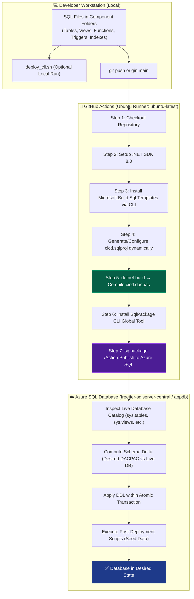

# 🚀 Azure SQL CI/CD: 100% CLI-Driven Step-by-Step Implementation Guide

> **Goal**: Build and deploy a production-grade, state-based CI/CD pipeline for **Azure SQL Database** using **GitHub Actions (Ubuntu Runner)** and **.NET / SqlPackage CLI** — with **zero reliance** on Visual Studio extensions, GUI wizards, or manual `.sqlproj` authoring.

---

## 📑 Table of Contents

1. [Architectural Overview](#-1-architectural-overview)
2. [Local Project & Component Folder Structure](#-2-local-project--component-folder-structure)
3. [Step 1: Prerequisites & Tooling](#-step-1-prerequisites--tooling)
4. [Step 2: Component Database Object Definitions](#-step-2-component-database-object-definitions)
   - [Tables](#-tables)
   - [Views](#-views)
   - [Scalar Functions](#-scalar-functions)
   - [Table-Valued Functions](#-table-valued-functions)
   - [Triggers](#-triggers)
   - [Indexes](#-indexes)
5. [Step 3: Post-Deployment Data Seeding](#-step-3-post-deployment-data-seeding)
6. [Step 4: Dynamic CLI Project Generation (`cicd.sqlproj`)](#-step-4-dynamic-cli-project-generation-cicdsqlproj)
7. [Step 5: Local Build & Compilation (`dotnet build`)](#-step-5-local-build--compilation-dotnet-build)
8. [Step 6: Azure SQL Database & Secrets Configuration](#-step-6-azure-sql-database--secrets-configuration)
9. [Step 7: GitHub Actions CI/CD Pipeline on Ubuntu](#-step-7-github-actions-cicd-pipeline-on-ubuntu)
10. [Step 8: Standalone CLI Deployment (`deploy_cli.sh`)](#-step-8-standalone-cli-deployment-deploy_clish)
11. [Step 9: Database Reset & Cleanup Utility (`cleanup_appdb.sql`)](#-step-9-database-reset--cleanup-utility-cleanup_appdbsql)
12. [Step 10: Verification & Testing Queries](#-step-10-verification--testing-queries)
13. [Troubleshooting & FAQ](#-troubleshooting--faq)

---

## 🏛️ 1. Architectural Overview



### Why 100% CLI-Driven?
- **No IDE Blockage**: Works in environments where Visual Studio / Azure Data Studio extensions cannot be installed.
- **Cross-Platform**: Runs identically on macOS, Linux (Ubuntu), Windows, or CI/CD runners.
- **Declarative & Automated**: Developers only write raw `.sql` files; the pipeline handles compilation into a DACPAC and differential deployment automatically.

---

## 📁 2. Local Project & Component Folder Structure

The project organizes database objects by **component type** under `dbo/`:

```
SQL-CICD/
├── .github/
│   └── workflows/
│       └── main.yml                         # Ubuntu-based GitHub Actions CI/CD Pipeline
├── dbo/
│   ├── Tables/                              # Table Definitions
│   │   ├── EmployeeDummy.sql
│   │   ├── persondetails.sql
│   │   ├── SchemaEvolutionDemo.sql
│   │   └── AuditLog.sql                     # Audit trail table for trigger
│   ├── Views/                               # View Definitions
│   │   └── vw_ActiveEmployees.sql           # Active employees filtered view
│   ├── Functions/
│   │   ├── Scalar/                          # Scalar Functions
│   │   │   └── fn_CalculateBonus.sql        # Salary bonus calculation
│   │   └── TableValued/                     # Table-Valued Functions
│   │       └── fn_GetEmployeesByDepartment.sql # Filter employees by department
│   ├── Triggers/                            # Database Triggers
│   │   └── trg_AuditEmployeeChanges.sql     # AFTER INSERT/UPDATE/DELETE audit logger
│   ├── Indexes/                             # Standalone Index Definitions
│   │   └── IX_EmployeeDummy_Department.sql  # Department lookup index
│   └── StoredProcedures/                    # Stored Procedures
│       └── GetEmployeeDetails.sql           # Employee lookup procedure
├── PostDeployment/                          # Post-Deployment Data Seeding
│   ├── PostDeployment.sql                   # Master orchestrator script
│   ├── Employeedummy.sql                    # Seed data for EmployeeDummy
│   ├── Persondata.sql                       # Seed data for person
│   └── AuditLogSeed.sql                     # Seed placeholder for AuditLog
├── cicd.sqlproj                             # SQL Project File (CLI-generated)
├── deploy_cli.sh                            # Standalone local CLI deployment script
├── cleanup_appdb.sql                        # Database reset utility script
└── README.md
```

---

## 🔧 Step 1: Prerequisites & Tooling

To build or deploy locally, ensure the following CLI tools are available:

| Tool | Version | Purpose | Installation |
| :--- | :--- | :--- | :--- |
| **.NET SDK** | `8.0.x` | Compiles `.sqlproj` into DACPAC | `brew install --cask dotnet-sdk` (macOS) / `sudo apt install dotnet-sdk-8.0` (Linux) |
| **SqlPackage** | `170.x+` | Deploys DACPAC to Azure SQL | `dotnet tool install --global microsoft.sqlpackage` |
| **Git** | `2.x+` | Version control & CI/CD trigger | `brew install git` / `sudo apt install git` |

---

## 📝 Step 2: Component Database Object Definitions

Each database object is placed in its dedicated component folder under `dbo/`.

### 📦 Tables

#### 1. [`dbo/Tables/SchemaEvolutionDemo.sql`](file:///Users/rohitjha/Documents/Git-master/SQL-CICD/dbo/Tables/SchemaEvolutionDemo.sql)
Demonstrates Primary Key, Unique Constraint, CHECK constraint, and DEFAULT values:
```sql
CREATE TABLE [dbo].[SchemaEvolutionDemo]
(
    [ID] INT NOT NULL PRIMARY KEY,
    [UniqueCode] NVARCHAR(50) NOT NULL UNIQUE,
    [Name] NVARCHAR(100) NOT NULL,
    [Department] NVARCHAR(50) NULL,
    [Salary] DECIMAL(18, 2) NULL,
    [Status] NVARCHAR(20) NOT NULL DEFAULT 'Active' CHECK ([Status] IN ('Active', 'Inactive', 'Pending')),
    [CreatedAt] DATETIME2 NOT NULL DEFAULT SYSUTCDATETIME()
);
GO

CREATE NONCLUSTERED INDEX [IX_SchemaEvolutionDemo_Department]
    ON [dbo].[SchemaEvolutionDemo] ([Department] ASC);
GO
```

#### 2. [`dbo/Tables/AuditLog.sql`](file:///Users/rohitjha/Documents/Git-master/SQL-CICD/dbo/Tables/AuditLog.sql)
Captures historical audit records from database operations:
```sql
CREATE TABLE [dbo].[AuditLog] (
    [AuditID]      INT            IDENTITY (1, 1) NOT NULL,
    [TableName]    NVARCHAR (128) NOT NULL,
    [Operation]    NVARCHAR (10)  NOT NULL,
    [RecordID]     INT            NOT NULL,
    [ChangedBy]    NVARCHAR (128) NOT NULL DEFAULT SUSER_SNAME(),
    [ChangedAt]    DATETIME2      NOT NULL DEFAULT SYSUTCDATETIME(),
    [OldValues]    NVARCHAR (MAX) NULL,
    [NewValues]    NVARCHAR (MAX) NULL,
    PRIMARY KEY CLUSTERED ([AuditID] ASC)
);
GO
```

---

### 👁️ Views

#### [`dbo/Views/vw_ActiveEmployees.sql`](file:///Users/rohitjha/Documents/Git-master/SQL-CICD/dbo/Views/vw_ActiveEmployees.sql)
A filtered view exposing active records:
```sql
CREATE VIEW [dbo].[vw_ActiveEmployees]
AS
    SELECT
        [ID],
        [UniqueCode],
        [Name],
        [Department],
        [Salary],
        [CreatedAt]
    FROM
        [dbo].[SchemaEvolutionDemo]
    WHERE
        [Status] = 'Active';
GO
```

---

### 🧮 Scalar Functions

#### [`dbo/Functions/Scalar/fn_CalculateBonus.sql`](file:///Users/rohitjha/Documents/Git-master/SQL-CICD/dbo/Functions/Scalar/fn_CalculateBonus.sql)
Computes bonus payouts based on department rules:
```sql
CREATE FUNCTION [dbo].[fn_CalculateBonus]
(
    @Salary     DECIMAL(18, 2),
    @Department NVARCHAR(50)
)
RETURNS DECIMAL(18, 2)
AS
BEGIN
    DECLARE @BonusPercent DECIMAL(5, 2);

    SET @BonusPercent = CASE
        WHEN @Department = 'Engineering' THEN 15.00
        WHEN @Department = 'Product'     THEN 12.00
        WHEN @Department = 'DevOps'      THEN 13.00
        ELSE 10.00
    END;

    RETURN @Salary * @BonusPercent / 100.00;
END;
GO
```

---

### 📊 Table-Valued Functions

#### [`dbo/Functions/TableValued/fn_GetEmployeesByDepartment.sql`](file:///Users/rohitjha/Documents/Git-master/SQL-CICD/dbo/Functions/TableValued/fn_GetEmployeesByDepartment.sql)
An inline table-valued function returning employee rows by department:
```sql
CREATE FUNCTION [dbo].[fn_GetEmployeesByDepartment]
(
    @Department NVARCHAR(50)
)
RETURNS TABLE
AS
RETURN
(
    SELECT
        [ID],
        [UniqueCode],
        [Name],
        [Department],
        [Salary],
        [Status],
        [CreatedAt]
    FROM
        [dbo].[SchemaEvolutionDemo]
    WHERE
        [Department] = @Department
);
GO
```

---

### ⚡ Triggers

#### [`dbo/Triggers/trg_AuditEmployeeChanges.sql`](file:///Users/rohitjha/Documents/Git-master/SQL-CICD/dbo/Triggers/trg_AuditEmployeeChanges.sql)
Logs all `INSERT`, `UPDATE`, and `DELETE` actions on `SchemaEvolutionDemo` to `dbo.AuditLog`:
```sql
CREATE TRIGGER [dbo].[trg_AuditEmployeeChanges]
ON [dbo].[SchemaEvolutionDemo]
AFTER INSERT, UPDATE, DELETE
AS
BEGIN
    SET NOCOUNT ON;

    -- Log INSERTs
    INSERT INTO [dbo].[AuditLog] ([TableName], [Operation], [RecordID], [NewValues])
    SELECT
        'SchemaEvolutionDemo',
        'INSERT',
        i.[ID],
        CONCAT('Name=', i.[Name], '|Dept=', i.[Department], '|Status=', i.[Status])
    FROM inserted i
    WHERE NOT EXISTS (SELECT 1 FROM deleted d WHERE d.[ID] = i.[ID]);

    -- Log DELETEs
    INSERT INTO [dbo].[AuditLog] ([TableName], [Operation], [RecordID], [OldValues])
    SELECT
        'SchemaEvolutionDemo',
        'DELETE',
        d.[ID],
        CONCAT('Name=', d.[Name], '|Dept=', d.[Department], '|Status=', d.[Status])
    FROM deleted d
    WHERE NOT EXISTS (SELECT 1 FROM inserted i WHERE i.[ID] = d.[ID]);

    -- Log UPDATEs
    INSERT INTO [dbo].[AuditLog] ([TableName], [Operation], [RecordID], [OldValues], [NewValues])
    SELECT
        'SchemaEvolutionDemo',
        'UPDATE',
        i.[ID],
        CONCAT('Name=', d.[Name], '|Dept=', d.[Department], '|Status=', d.[Status]),
        CONCAT('Name=', i.[Name], '|Dept=', i.[Department], '|Status=', i.[Status])
    FROM inserted i
    INNER JOIN deleted d ON i.[ID] = d.[ID];
END;
GO
```

---

### 🔍 Indexes

#### [`dbo/Indexes/IX_EmployeeDummy_Department.sql`](file:///Users/rohitjha/Documents/Git-master/SQL-CICD/dbo/Indexes/IX_EmployeeDummy_Department.sql)
Standalone nonclustered index on `EmployeeDummy(Department)`:
```sql
CREATE NONCLUSTERED INDEX [IX_EmployeeDummy_Department]
    ON [dbo].[EmployeeDummy] ([Department] ASC);
GO
```

---

## 📦 Step 3: Post-Deployment Data Seeding

Post-deployment scripts run **after** all DDL changes have been applied to ensure reference/seed data exists.

#### [`PostDeployment/PostDeployment.sql`](file:///Users/rohitjha/Documents/Git-master/SQL-CICD/PostDeployment/PostDeployment.sql) (Master Orchestrator)
```sql
:r ./Employeedummy.sql
:r ./Persondata.sql
:r ./AuditLogSeed.sql
```

> **Important**: Uses forward slashes `./` and exact file casing for compatibility across Linux and Windows runners.

---

## ⚙️ Step 4: Dynamic CLI Project Generation (`cicd.sqlproj`)

Instead of requiring an IDE extension to generate the `.sqlproj`, the CLI generates and configures it dynamically:

```bash
# 1. Install SQL project template
dotnet new install Microsoft.Build.Sql.Templates

# 2. Generate project file targeting Azure SQL V12
dotnet new sqlproj -n cicd -tp SqlAzureV12
```

The resulting [`cicd.sqlproj`](file:///Users/rohitjha/Documents/Git-master/SQL-CICD/cicd.sqlproj) specifies exclusions and the post-deployment script:

```xml
<?xml version="1.0" encoding="utf-8"?>
<Project DefaultTargets="Build">
  <Sdk Name="Microsoft.Build.Sql" Version="2.2.0" />
  <PropertyGroup>
    <Name>cicd</Name>
    <DSP>Microsoft.Data.Tools.Schema.Sql.SqlAzureV12DatabaseSchemaProvider</DSP>
    <ModelCollation>1033, CI</ModelCollation>
    <TargetFramework>netstandard2.1</TargetFramework>
    <SqlServerVersion>SqlAzureV12</SqlServerVersion>
  </PropertyGroup>
  <ItemGroup>
    <Build Remove=".github/**/*.sql" />
    <Build Remove="cicd/**/*.sql" />
    <Build Remove="PostDeployment/**/*.sql" />
    <Build Remove="cleanup_appdb.sql" />
    <PostDeploy Include="PostDeployment/PostDeployment.sql" />
  </ItemGroup>
  <Target Name="BeforeBuild">
    <Delete Files="$(BaseIntermediateOutputPath)/project.assets.json" />
  </Target>
</Project>
```

---

## 🔨 Step 5: Local Build & Compilation (`dotnet build`)

To compile all `.sql` files into a deployable binary DACPAC artifact:

```bash
dotnet build cicd.sqlproj --configuration Release
```

**Expected Output:**
```text
  Determining projects to restore...
  All projects are up-to-date for restore.
  Creating a model to represent the project...
  Loading project files...
  Building the project model and resolving object interdependencies...
  Validating the project model...
  Writing model to /path/to/SQL-CICD/obj/Release/Model.xml...
  cicd -> /path/to/SQL-CICD/bin/Release/cicd.dacpac

Build succeeded.
    0 Warning(s)
    0 Error(s)
```

The compiled package is written to [`bin/Release/cicd.dacpac`](file:///Users/rohitjha/Documents/Git-master/SQL-CICD/bin/Release/cicd.dacpac).

---

## 🔐 Step 6: Azure SQL Database & Secrets Configuration

### 1. Azure SQL Server Firewall
In the [Azure Portal](https://portal.azure.com):
- Go to Server: **`freetier-sqlserver-central`** → **Networking**
- Ensure **"Allow Azure services and resources to access this server"** is **enabled**.
- (For local deployment) Add your client IPv4 address to the firewall rules.

### 2. GitHub Secret Configuration
In your GitHub repo (**Settings → Secrets and variables → Actions**):
- Add secret name: **`SQL_CONNECTION_STRING`**
- Value:
```text
Server=tcp:freetier-sqlserver-central.database.windows.net,1433;Initial Catalog=appdb;Persist Security Info=False;User ID=<YOUR_SQL_USERNAME>;Password=<YOUR_SQL_PASSWORD>;MultipleActiveResultSets=False;Encrypt=True;TrustServerCertificate=False;Connection Timeout=30;
```

---

## 🐙 Step 7: GitHub Actions CI/CD Pipeline on Ubuntu

The workflow file is located at [`.github/workflows/main.yml`](file:///Users/rohitjha/Documents/Git-master/SQL-CICD/.github/workflows/main.yml):

```yaml
name: SQL Database CI/CD

on:
  push:
    branches:
      - main
  workflow_dispatch:

jobs:
  build-and-deploy:
    runs-on: ubuntu-latest

    steps:
      - uses: actions/checkout@v4

      - uses: actions/setup-dotnet@v4
        with:
          dotnet-version: '8.0.x'

      - name: Install SQL Project Template (CLI)
        run: dotnet new install Microsoft.Build.Sql.Templates

      - name: Generate or Configure .sqlproj via CLI
        run: |
          if [ ! -f "cicd.sqlproj" ]; then
            echo "cicd.sqlproj not found. Creating via dotnet new CLI..."
            dotnet new sqlproj -n cicd -tp SqlAzureV12
          fi
          
          # Ensure exclusions and post-deployment configuration are set
          cat << 'EOF' > cicd.sqlproj
          <?xml version="1.0" encoding="utf-8"?>
          <Project DefaultTargets="Build">
            <Sdk Name="Microsoft.Build.Sql" Version="2.2.0" />
            <PropertyGroup>
              <Name>cicd</Name>
              <DSP>Microsoft.Data.Tools.Schema.Sql.SqlAzureV12DatabaseSchemaProvider</DSP>
              <ModelCollation>1033, CI</ModelCollation>
              <TargetFramework>netstandard2.1</TargetFramework>
              <SqlServerVersion>SqlAzureV12</SqlServerVersion>
            </PropertyGroup>
            <ItemGroup>
              <Build Remove=".github/**/*.sql" />
              <Build Remove="cicd/**/*.sql" />
              <Build Remove="PostDeployment/**/*.sql" />
              <Build Remove="cleanup_appdb.sql" />
              <PostDeploy Include="PostDeployment/PostDeployment.sql" />
            </ItemGroup>
            <Target Name="BeforeBuild">
              <Delete Files="$(BaseIntermediateOutputPath)/project.assets.json" />
            </Target>
          </Project>
          EOF

      - name: Build SQL Project (Compile DACPAC)
        run: dotnet build cicd.sqlproj --configuration Release

      - name: Install SqlPackage
        run: |
          dotnet tool install --global microsoft.sqlpackage
          echo "$HOME/.dotnet/tools" >> $GITHUB_PATH

      - name: Verify DACPAC Artifact
        run: |
          ls -la bin/Release/

      - name: Publish DACPAC to Azure SQL (appdb)
        run: |
          sqlpackage \
            /Action:Publish \
            /SourceFile:"./bin/Release/cicd.dacpac" \
            /TargetConnectionString:"${{ secrets.SQL_CONNECTION_STRING }}"
```

---

## 💻 Step 8: Standalone CLI Deployment (`deploy_cli.sh`)

For local execution without waiting for GitHub Actions:

```bash
# 1. Export your connection string
export SQL_CONNECTION_STRING="Server=tcp:freetier-sqlserver-central.database.windows.net,1433;Initial Catalog=appdb;Persist Security Info=False;User ID=<USER>;Password=<PASS>;MultipleActiveResultSets=False;Encrypt=True;TrustServerCertificate=False;Connection Timeout=30;"

# 2. Run the deployment script
./deploy_cli.sh
```

---

## 🧹 Step 9: Database Reset & Cleanup Utility (`cleanup_appdb.sql`)

To drop all existing objects in `appdb` before a clean redeployment, run [`cleanup_appdb.sql`](file:///Users/rohitjha/Documents/Git-master/SQL-CICD/cleanup_appdb.sql) in Azure Portal Query Editor:

```sql
DROP TRIGGER IF EXISTS [dbo].[trg_AuditEmployeeChanges];
DROP VIEW IF EXISTS [dbo].[vw_ActiveEmployees];
DROP PROCEDURE IF EXISTS [dbo].[GetEmployeeDetails];
DROP FUNCTION IF EXISTS [dbo].[fn_GetEmployeesByDepartment];
DROP FUNCTION IF EXISTS [dbo].[fn_CalculateBonus];
DROP TABLE IF EXISTS [dbo].[AuditLog];
DROP TABLE IF EXISTS [dbo].[SchemaEvolutionDemo];
DROP TABLE IF EXISTS [dbo].[person];
DROP TABLE IF EXISTS [dbo].[EmployeeDummy];
```

---

## 🧪 Step 10: Verification & Testing Queries

After deployment, run these queries in Azure SQL Query Editor to verify all components:

### 1. Verify Tables & Seed Data
```sql
SELECT * FROM dbo.person;
SELECT * FROM dbo.EmployeeDummy;
```

### 2. Verify View
```sql
SELECT * FROM dbo.vw_ActiveEmployees;
```

### 3. Verify Scalar Function
```sql
SELECT dbo.fn_CalculateBonus(100000.00, 'Engineering') AS EngineeringBonus;
SELECT dbo.fn_CalculateBonus(100000.00, 'HR')          AS StandardBonus;
```

### 4. Verify Table-Valued Function
```sql
SELECT * FROM dbo.fn_GetEmployeesByDepartment('Engineering');
```

### 5. Verify Trigger & Audit Log
```sql
-- Insert a test record
INSERT INTO dbo.SchemaEvolutionDemo (ID, UniqueCode, Name, Department, Salary, Status)
VALUES (101, 'EMP101', 'Test Employee', 'DevOps', 95000.00, 'Active');

-- Update the test record
UPDATE dbo.SchemaEvolutionDemo
SET Status = 'Inactive'
WHERE ID = 101;

-- Check the AuditLog table
SELECT * FROM dbo.AuditLog ORDER BY ChangedAt DESC;
```

---

## ❓ Troubleshooting & FAQ

| Symptom | Probable Cause | Resolution |
| :--- | :--- | :--- |
| `Cannot open server requested by login` | Azure SQL Firewall blocking IP | Enable "Allow Azure services and resources" in Azure SQL Networking. |
| `Login failed for user` | Invalid credentials | Check username/password in `SQL_CONNECTION_STRING` secret. |
| `File not found in PostDeployment` on Linux | Case-sensitivity mismatch | Ensure file names in `PostDeployment.sql` match exact disk casing (`Employeedummy.sql`, `Persondata.sql`). |
| `dotnet: command not found` | .NET SDK missing | Ensure `actions/setup-dotnet@v4` with `8.0.x` is included in the workflow. |
| `Data loss might occur` error | Column dropped or narrowed | Set `/p:BlockOnPossibleDataLoss=False` in `SqlPackage` command if data loss is intentional. |

---

*Document Version: 2.0 — 100% CLI Azure SQL CI/CD Guide*  
*Last Updated: 14 August 2026*
